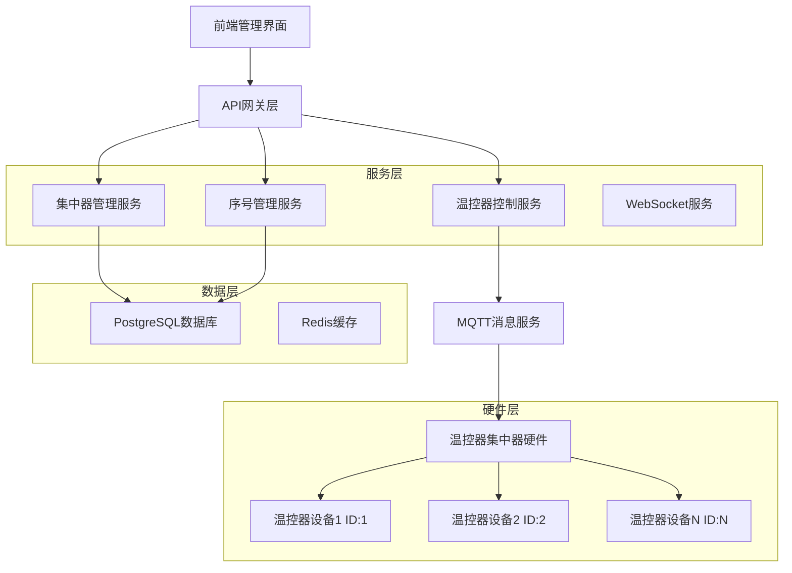
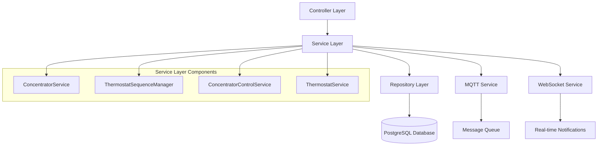
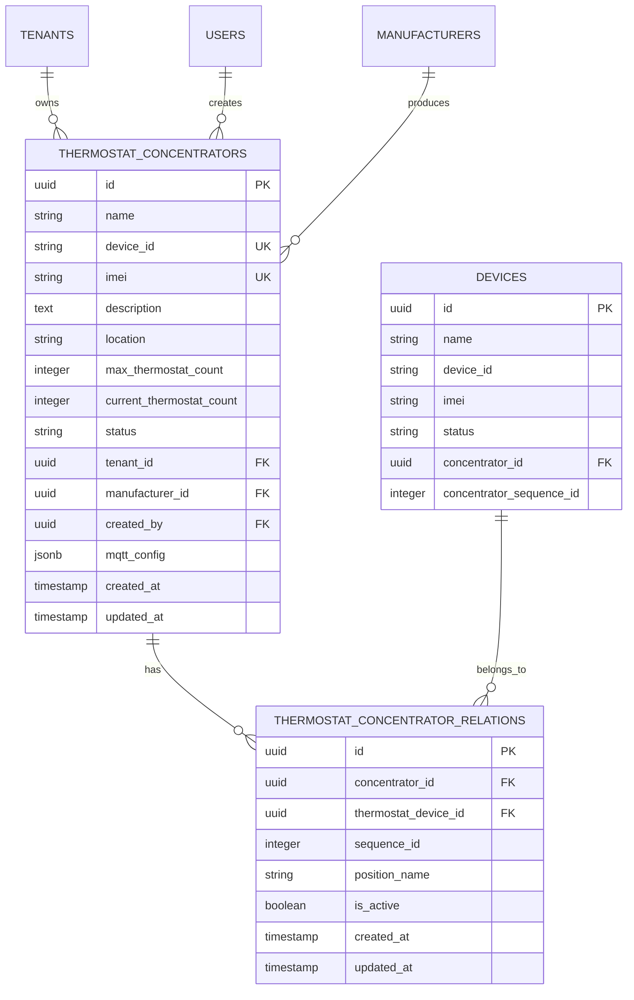

# 温控器集中器系统技术架构文档

## 1. 架构设计



## 2. 技术描述

- **前端**: Vue.js 3 + Element Plus + Vite
- **后端**: Node.js + Express.js + Sequelize ORM
- **数据库**: PostgreSQL 13+
- **消息队列**: MQTT (Mosquitto)
- **缓存**: Redis (可选)
- **实时通信**: WebSocket

## 3. 路由定义

| 路由 | 方法 | 用途 |
|------|------|------|
| `/thermostat-concentrators` | GET | 获取集中器列表 |
| `/thermostat-concentrators` | POST | 创建新集中器 |
| `/thermostat-concentrators/:id` | GET | 获取集中器详情 |
| `/thermostat-concentrators/:id` | PUT | 更新集中器信息 |
| `/thermostat-concentrators/:id` | DELETE | 删除集中器 |
| `/thermostat-concentrators/:id/thermostats` | GET | 获取集中器下的温控器列表 |
| `/thermostat-concentrators/:id/thermostats` | POST | 添加温控器到集中器 |
| `/thermostat-concentrators/:id/thermostats/:tid` | DELETE | 从集中器移除温控器 |
| `/thermostat-concentrators/:id/thermostats/reorder` | PUT | 重新排序温控器序号 |
| `/thermostat-concentrators/:id/control/batch` | POST | 批量控制集中器下的温控器 |

## 4. API定义

### 4.1 集中器管理API

#### 创建集中器
```
POST /api/thermostat-concentrators
```

请求参数：
| 参数名 | 类型 | 必填 | 描述 |
|--------|------|------|------|
| name | string | 是 | 集中器名称 |
| device_id | string | 是 | 设备ID |
| imei | string | 否 | IMEI号码 |
| description | string | 否 | 描述信息 |
| location | string | 否 | 安装位置 |
| max_thermostat_count | integer | 否 | 最大温控器数量，默认16 |
| manufacturer_id | string | 否 | 厂商ID |

响应示例：
```json
{
    "success": true,
    "data": {
        "id": "uuid",
        "name": "办公楼A座集中器",
        "device_id": "CONC001",
        "current_thermostat_count": 0,
        "max_thermostat_count": 16,
        "status": "online"
    }
}
```

#### 添加温控器到集中器
```
POST /api/thermostat-concentrators/:concentratorId/thermostats
```

请求参数：
| 参数名 | 类型 | 必填 | 描述 |
|--------|------|------|------|
| thermostat_device_id | string | 是 | 温控器设备ID |
| position_name | string | 否 | 位置名称 |

响应示例：
```json
{
    "success": true,
    "data": {
        "id": "uuid",
        "sequence_id": 3,
        "position_name": "客厅3号",
        "thermostat_device": {
            "id": "uuid",
            "name": "客厅温控器",
            "status": "online"
        }
    }
}
```

### 4.2 温控器控制API

#### 批量控制温控器
```
POST /api/thermostat-concentrators/:concentratorId/control/batch
```

请求参数：
| 参数名 | 类型 | 必填 | 描述 |
|--------|------|------|------|
| action | string | 是 | 控制动作：power_on, power_off, set_temperature, set_mode |
| target_ids | array | 否 | 目标温控器序号ID数组，不传则控制所有 |
| parameters | object | 否 | 控制参数 |

请求示例：
```json
{
    "action": "set_temperature",
    "target_ids": [1, 2, 3],
    "parameters": {
        "temperature": 26
    }
}
```

## 5. 服务架构图



## 6. 数据模型

### 6.1 数据模型定义



### 6.2 数据定义语言

#### 温控器集中器表
```sql
-- 创建温控器集中器表
CREATE TABLE thermostat_concentrators (
    id UUID PRIMARY KEY DEFAULT gen_random_uuid(),
    name VARCHAR(100) NOT NULL,
    device_id VARCHAR(100) NOT NULL UNIQUE,
    imei VARCHAR(50) UNIQUE,
    description TEXT,
    location VARCHAR(200),
    max_thermostat_count INTEGER DEFAULT 16,
    current_thermostat_count INTEGER DEFAULT 0,
    status VARCHAR(20) DEFAULT 'online' CHECK (status IN ('online', 'offline', 'fault', 'maintenance')),
    tenant_id UUID NOT NULL REFERENCES tenants(id),
    manufacturer_id UUID REFERENCES manufacturers(id),
    created_by UUID NOT NULL REFERENCES users(id),
    mqtt_config JSONB DEFAULT '{}',
    protocol_config_id UUID REFERENCES protocol_configs(id),
    created_at TIMESTAMP WITH TIME ZONE DEFAULT NOW(),
    updated_at TIMESTAMP WITH TIME ZONE DEFAULT NOW()
);

-- 创建索引
CREATE INDEX idx_thermostat_concentrators_tenant_id ON thermostat_concentrators(tenant_id);
CREATE INDEX idx_thermostat_concentrators_device_id ON thermostat_concentrators(device_id);
CREATE INDEX idx_thermostat_concentrators_status ON thermostat_concentrators(status);

-- 创建触发器更新updated_at
CREATE OR REPLACE FUNCTION update_thermostat_concentrators_updated_at()
RETURNS TRIGGER AS $$
BEGIN
    NEW.updated_at = NOW();
    RETURN NEW;
END;
$$ LANGUAGE plpgsql;

CREATE TRIGGER trigger_update_thermostat_concentrators_updated_at
    BEFORE UPDATE ON thermostat_concentrators
    FOR EACH ROW
    EXECUTE FUNCTION update_thermostat_concentrators_updated_at();
```

#### 温控器集中器关联表
```sql
-- 创建温控器集中器关联表
CREATE TABLE thermostat_concentrator_relations (
    id UUID PRIMARY KEY DEFAULT gen_random_uuid(),
    concentrator_id UUID NOT NULL REFERENCES thermostat_concentrators(id) ON DELETE CASCADE,
    thermostat_device_id UUID NOT NULL REFERENCES devices(id) ON DELETE CASCADE,
    sequence_id INTEGER NOT NULL,
    position_name VARCHAR(50),
    is_active BOOLEAN DEFAULT true,
    created_at TIMESTAMP WITH TIME ZONE DEFAULT NOW(),
    updated_at TIMESTAMP WITH TIME ZONE DEFAULT NOW(),
    
    -- 确保同一集中器下序号唯一
    UNIQUE(concentrator_id, sequence_id),
    -- 确保同一温控器不能关联到多个集中器
    UNIQUE(thermostat_device_id)
);

-- 创建索引
CREATE INDEX idx_thermostat_concentrator_relations_concentrator_id ON thermostat_concentrator_relations(concentrator_id);
CREATE INDEX idx_thermostat_concentrator_relations_thermostat_device_id ON thermostat_concentrator_relations(thermostat_device_id);
CREATE INDEX idx_thermostat_concentrator_relations_sequence_id ON thermostat_concentrator_relations(concentrator_id, sequence_id);

-- 创建触发器更新updated_at
CREATE TRIGGER trigger_update_thermostat_concentrator_relations_updated_at
    BEFORE UPDATE ON thermostat_concentrator_relations
    FOR EACH ROW
    EXECUTE FUNCTION update_thermostat_concentrators_updated_at();
```

#### 修改设备表
```sql
-- 为设备表添加集中器关联字段
ALTER TABLE devices ADD COLUMN concentrator_id UUID REFERENCES thermostat_concentrators(id);
ALTER TABLE devices ADD COLUMN concentrator_sequence_id INTEGER;

-- 创建索引
CREATE INDEX idx_devices_concentrator_id ON devices(concentrator_id);
CREATE INDEX idx_devices_concentrator_sequence ON devices(concentrator_id, concentrator_sequence_id);
```

#### 初始化数据
```sql
-- 插入温控器集中器设备类型
INSERT INTO device_types (name, code, description, protocol, data_format) 
VALUES (
    '温控器集中器', 
    'thermostat_concentrator', 
    '温控器集中器设备，可管理多个温控器', 
    'mqtt', 
    '{
        "data_fields": [
            {"name": "status", "type": "string", "description": "集中器状态"},
            {"name": "thermostat_count", "type": "integer", "description": "连接的温控器数量"},
            {"name": "online_count", "type": "integer", "description": "在线温控器数量"}
        ]
    }'::jsonb
) ON CONFLICT (name) DO NOTHING;

-- 创建自动更新集中器温控器计数的触发器
CREATE OR REPLACE FUNCTION update_concentrator_thermostat_count()
RETURNS TRIGGER AS $$
BEGIN
    IF TG_OP = 'INSERT' THEN
        UPDATE thermostat_concentrators 
        SET current_thermostat_count = current_thermostat_count + 1,
            updated_at = NOW()
        WHERE id = NEW.concentrator_id;
        RETURN NEW;
    ELSIF TG_OP = 'DELETE' THEN
        UPDATE thermostat_concentrators 
        SET current_thermostat_count = current_thermostat_count - 1,
            updated_at = NOW()
        WHERE id = OLD.concentrator_id;
        RETURN OLD;
    END IF;
    RETURN NULL;
END;
$$ LANGUAGE plpgsql;

CREATE TRIGGER trigger_update_concentrator_thermostat_count
    AFTER INSERT OR DELETE ON thermostat_concentrator_relations
    FOR EACH ROW
    EXECUTE FUNCTION update_concentrator_thermostat_count();
```

## 7. 核心服务实现

### 7.1 序号管理服务
```javascript
class ThermostatSequenceManager {
    // 获取下一个可用序号
    async getNextSequenceId(concentratorId) {
        const maxSequence = await db.query(`
            SELECT COALESCE(MAX(sequence_id), 0) as max_id 
            FROM thermostat_concentrator_relations 
            WHERE concentrator_id = $1 AND is_active = true
        `, [concentratorId]);
        
        return maxSequence.rows[0].max_id + 1;
    }
    
    // 重新排序序号
    async reorderSequences(concentratorId, thermostatOrders) {
        const transaction = await db.transaction();
        try {
            for (const order of thermostatOrders) {
                await db.query(`
                    UPDATE thermostat_concentrator_relations 
                    SET sequence_id = $1, updated_at = NOW()
                    WHERE concentrator_id = $2 AND thermostat_device_id = $3
                `, [order.sequence_id, concentratorId, order.thermostat_device_id]);
            }
            await transaction.commit();
        } catch (error) {
            await transaction.rollback();
            throw error;
        }
    }
}
```

### 7.2 集中器控制服务
```javascript
class ConcentratorControlService {
    // 修改温控器控制逻辑，支持集中器序号ID
    async setThermostatId(deviceId, controlCommand) {
        if (!controlCommand.body.id) {
            // 检查设备是否属于集中器
            const relation = await db.query(`
                SELECT sequence_id 
                FROM thermostat_concentrator_relations 
                WHERE thermostat_device_id = $1 AND is_active = true
            `, [deviceId]);
            
            if (relation.rows.length > 0) {
                // 使用集中器中的序号ID
                controlCommand.body.id = [relation.rows[0].sequence_id];
            } else {
                // 独立温控器使用默认ID
                controlCommand.body.id = [1];
            }
        }
        return controlCommand;
    }
    
    // 批量控制集中器下的温控器
    async batchControl(concentratorId, action, targetIds, parameters) {
        const thermostats = await this.getConcentratorThermostats(concentratorId, targetIds);
        const results = [];
        
        for (const thermostat of thermostats) {
            try {
                const result = await this.controlSingleThermostat(
                    thermostat.device_id, 
                    action, 
                    parameters,
                    thermostat.sequence_id
                );
                results.push({ device_id: thermostat.device_id, success: true, result });
            } catch (error) {
                results.push({ device_id: thermostat.device_id, success: false, error: error.message });
            }
        }
        
        return results;
    }
}
```

## 8. 部署和监控

### 8.1 部署架构
- **应用服务器**: Node.js应用部署在PM2进程管理器下
- **数据库**: PostgreSQL主从复制架构
- **消息服务**: MQTT Broker集群部署
- **负载均衡**: Nginx反向代理

### 8.2 监控指标
- 集中器在线率
- 温控器关联成功率
- 控制指令响应时间
- 序号ID分配冲突率
- 数据库连接池状态

### 8.3 日志管理
- 应用日志: Winston日志框架
- 访问日志: Nginx访问日志
- 错误日志: 集中化错误收集
- 审计日志: 操作审计追踪