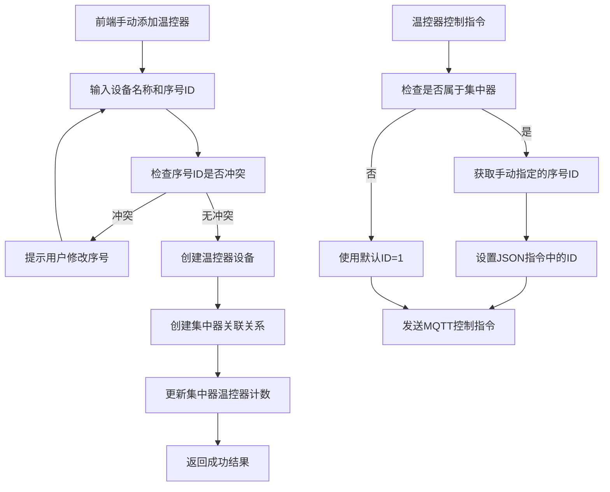

# 温控器集中器系统设计文档

## 1. 系统概述

本文档描述了温控器集中器系统的设计方案，该系统支持一个集中器管理多个温控器设备。每个温控器设备都有独立的设备名称，并且支持手动指定和修改在集中器中的序号ID。温控器在下发JSON控制指令时会使用其在集中器中的序号ID作为控制指令中的ID值。

## 2. 数据库设计

### 2.1 新增表结构

#### 温控器集中器表 (thermostat_concentrators)
```sql
CREATE TABLE thermostat_concentrators (
    id UUID PRIMARY KEY DEFAULT gen_random_uuid(),
    name VARCHAR(100) NOT NULL,
    device_id VARCHAR(100) NOT NULL UNIQUE,
    imei VARCHAR(50) UNIQUE,
    description TEXT,
    location VARCHAR(200),
    max_thermostat_count INTEGER DEFAULT 48, -- 最大支持的温控器数量
    current_thermostat_count INTEGER DEFAULT 0, -- 当前温控器数量
    status VARCHAR(20) DEFAULT 'online' CHECK (status IN ('online', 'offline', 'fault', 'maintenance')),
    tenant_id UUID NOT NULL REFERENCES tenants(id),
    manufacturer_id UUID REFERENCES manufacturers(id),
    created_by UUID NOT NULL REFERENCES users(id),
    mqtt_config JSONB DEFAULT '{}',
    protocol_config_id UUID REFERENCES protocol_configs(id),
    created_at TIMESTAMP WITH TIME ZONE DEFAULT NOW(),
    updated_at TIMESTAMP WITH TIME ZONE DEFAULT NOW()
);

-- 创建索引
CREATE INDEX idx_thermostat_concentrators_tenant_id ON thermostat_concentrators(tenant_id);
CREATE INDEX idx_thermostat_concentrators_device_id ON thermostat_concentrators(device_id);
CREATE INDEX idx_thermostat_concentrators_status ON thermostat_concentrators(status);
```

#### 温控器与集中器关联表 (thermostat_concentrator_relations)
```sql
CREATE TABLE thermostat_concentrator_relations (
    id UUID PRIMARY KEY DEFAULT gen_random_uuid(),
    concentrator_id UUID NOT NULL REFERENCES thermostat_concentrators(id) ON DELETE CASCADE,
    thermostat_device_id UUID NOT NULL REFERENCES devices(id) ON DELETE CASCADE,
    sequence_id INTEGER NOT NULL, -- 在集中器中的序号ID (1, 2, 3...)
    position_name VARCHAR(50), -- 位置名称，如"客厅1号"、"卧室2号"
    is_active BOOLEAN DEFAULT true,
    created_at TIMESTAMP WITH TIME ZONE DEFAULT NOW(),
    updated_at TIMESTAMP WITH TIME ZONE DEFAULT NOW(),
    
    -- 确保同一集中器下序号唯一
    UNIQUE(concentrator_id, sequence_id),
    -- 确保同一温控器不能关联到多个集中器
    UNIQUE(thermostat_device_id)
);

-- 创建索引
CREATE INDEX idx_thermostat_concentrator_relations_concentrator_id ON thermostat_concentrator_relations(concentrator_id);
CREATE INDEX idx_thermostat_concentrator_relations_thermostat_device_id ON thermostat_concentrator_relations(thermostat_device_id);
CREATE INDEX idx_thermostat_concentrator_relations_sequence_id ON thermostat_concentrator_relations(concentrator_id, sequence_id);
```

### 2.2 修改现有表结构

#### 设备类型表 (device_types) - 新增温控器集中器类型
```sql
-- 插入温控器集中器设备类型
INSERT INTO device_types (name, code, description, protocol, data_format) 
VALUES (
    '温控器集中器', 
    'thermostat_concentrator', 
    '温控器集中器设备，可管理多个温控器', 
    'mqtt', 
    '{
        "data_fields": [
            {"name": "status", "type": "string", "description": "集中器状态"},
            {"name": "thermostat_count", "type": "integer", "description": "连接的温控器数量"},
            {"name": "online_count", "type": "integer", "description": "在线温控器数量"}
        ]
    }'::jsonb
);
```

#### 设备表 (devices) - 增加集中器关联字段
```sql
-- 为现有设备表添加集中器关联字段
ALTER TABLE devices ADD COLUMN concentrator_id UUID REFERENCES thermostat_concentrators(id);
ALTER TABLE devices ADD COLUMN concentrator_sequence_id INTEGER;

-- 创建索引
CREATE INDEX idx_devices_concentrator_id ON devices(concentrator_id);
CREATE INDEX idx_devices_concentrator_sequence ON devices(concentrator_id, concentrator_sequence_id);
```

## 3. 系统架构设计

### 3.1 核心组件

1. **集中器管理服务 (ConcentratorService)**
   - 集中器设备的CRUD操作
   - 温控器与集中器的关联管理
   - 序号ID的自动分配和管理

2. **温控器序号管理器 (ThermostatSequenceManager)**
   - 支持手动指定和修改序号ID
   - 处理温控器添加、删除时的序号管理
   - 序号唯一性检查和冲突处理
   - 支持序号的灵活分配（不要求连续性）

3. **集中器控制服务 (ConcentratorControlService)**
   - 扩展现有的温控器控制逻辑
   - 根据集中器关联自动设置JSON指令中的ID
   - 支持批量控制和单个控制

### 3.2 数据流设计



## 4. API接口设计

### 4.1 集中器管理接口

#### 创建集中器
```
POST /api/thermostat-concentrators
```

请求体：
```json
{
    "name": "办公楼A座集中器",
    "device_id": "CONC001",
    "imei": "123456789012345",
    "description": "办公楼A座温控器集中器",
    "location": "办公楼A座1层",
    "max_thermostat_count": 48,
    "manufacturer_id": "uuid",
    "mqtt_config": {}
}
```

#### 获取集中器列表
```
GET /api/thermostat-concentrators
```

#### 获取集中器详情及关联的温控器
```
GET /api/thermostat-concentrators/:id/thermostats
```

响应：
```json
{
    "success": true,
    "data": {
        "concentrator": {
            "id": "uuid",
            "name": "办公楼A座集中器",
            "current_thermostat_count": 3,
            "max_thermostat_count": 48
        },
        "thermostats": [
            {
                "id": "uuid",
                "name": "客厅温控器",
                "sequence_id": 1,
                "position_name": "客厅1号",
                "status": "online"
            },
            {
                "id": "uuid", 
                "name": "卧室温控器",
                "sequence_id": 2,
                "position_name": "卧室2号",
                "status": "online"
            }
        ]
    }
}
```

### 4.2 温控器关联接口

#### 手动添加温控器到集中器
```
POST /api/thermostat-concentrators/:concentratorId/thermostats
```

请求体：
```json
{
    "device_name": "客厅温控器3号",
    "device_id": "THERM003",
    "imei": "123456789012347",
    "sequence_id": 3,
    "position_name": "客厅3号",
    "description": "客厅区域温控器设备"
}
```

响应：
```json
{
    "success": true,
    "message": "温控器添加成功",
    "data": {
        "thermostat_device_id": "uuid",
        "device_name": "客厅温控器3号",
        "sequence_id": 3,
        "position_name": "客厅3号"
    }
}
```

#### 从集中器移除温控器
```
DELETE /api/thermostat-concentrators/:concentratorId/thermostats/:thermostatId
```

#### 修改温控器序号ID
```
PUT /api/thermostat-concentrators/:concentratorId/thermostats/:thermostatId/sequence
```

请求体：
```json
{
    "sequence_id": 5
}
```

响应：
```json
{
    "success": true,
    "message": "序号ID修改成功",
    "data": {
        "thermostat_device_id": "uuid",
        "old_sequence_id": 3,
        "new_sequence_id": 5
    }
}
```

#### 批量修改温控器序号
```
PUT /api/thermostat-concentrators/:concentratorId/thermostats/batch-sequence
```

请求体：
```json
{
    "thermostat_sequences": [
        {"thermostat_device_id": "uuid1", "sequence_id": 1},
        {"thermostat_device_id": "uuid2", "sequence_id": 5},
        {"thermostat_device_id": "uuid3", "sequence_id": 10}
    ]
}
```

## 5. 业务逻辑设计

### 5.1 序号ID管理逻辑

1. **手动添加温控器时**：
   - 用户手动指定序号ID（1-48范围内）
   - 检查序号ID在当前集中器下是否已被占用
   - 如果冲突，提示用户选择其他序号
   - 检查是否超过最大限制（48个）
   - 创建温控器设备和关联关系
   - 更新集中器的温控器计数

2. **删除温控器时**：
   - 删除关联关系和设备记录
   - 释放对应的序号ID供后续使用
   - 更新集中器的温控器计数
   - 不自动重排其他温控器的序号

3. **修改序号ID**：
   - 支持单个温控器序号修改
   - 支持批量温控器序号修改
   - 确保新序号在集中器内的唯一性
   - 序号可以不连续（如：1, 3, 5, 10等）
   - 修改后立即生效，影响后续控制指令

### 5.2 控制指令处理逻辑

修改现有的 `thermostatService.js` 中的控制方法：

```javascript
// 原有逻辑
if (!controlCommand.body.id) {
    controlCommand.body.id = [1];
}

// 新逻辑
if (!controlCommand.body.id) {
    // 检查设备是否属于集中器
    const concentratorRelation = await this.getDeviceConcentratorRelation(deviceId);
    if (concentratorRelation) {
        // 使用集中器中的序号ID
        controlCommand.body.id = [concentratorRelation.sequence_id];
    } else {
        // 独立温控器使用默认ID
        controlCommand.body.id = [1];
    }
}
```

## 6. 兼容性考虑

### 6.1 向后兼容
- 现有的独立温控器继续使用ID=1的逻辑
- 现有API接口保持不变
- 现有数据不受影响

### 6.2 渐进式迁移
- 可以将现有温控器逐步关联到集中器
- 支持混合模式：部分温控器独立，部分属于集中器

## 7. 实施计划

### 阶段1：数据库结构调整
1. 创建集中器相关表
2. 修改现有表结构
3. 数据迁移脚本

### 阶段2：后端服务开发
1. 集中器管理服务
2. 序号管理器
3. 修改温控器控制逻辑

### 阶段3：前端界面开发
1. 集中器管理界面
2. 手动添加温控器表单（包含设备名称和序号ID输入）
3. 温控器序号ID管理界面
4. 序号冲突检查和提示功能
5. 批量控制界面

### 阶段4：测试和部署
1. 单元测试
2. 集成测试
3. 生产环境部署

## 8. 性能和并发控制优化

### 8.1 48个温控器的性能优化
- **批量操作优化**：支持批量控制指令，减少网络请求次数
- **连接池管理**：优化MQTT连接池，支持更多并发连接
- **缓存策略**：缓存集中器和温控器关联关系，减少数据库查询
- **异步处理**：控制指令异步发送，避免阻塞主线程

### 8.2 并发控制策略
- **序号分配锁**：使用分布式锁确保序号ID分配的原子性
- **批量更新事务**：温控器状态批量更新使用事务处理
- **限流控制**：对单个集中器的控制频率进行限流保护
- **队列机制**：大量控制指令使用消息队列缓冲处理

### 8.3 数据库优化
- **索引优化**：为高频查询字段添加复合索引
- **分页查询**：大量温控器列表使用分页加载
- **读写分离**：读操作使用从库，写操作使用主库
- **连接池调优**：根据48个温控器的并发需求调整连接池大小

## 9. 监控和维护

### 9.1 监控指标
- 集中器在线状态
- 温控器关联数量（最大48个）
- 控制指令成功率
- 序号ID分配情况
- 系统响应时间和吞吐量

### 9.2 日志记录
- 集中器操作日志
- 温控器关联变更日志
- 序号ID分配日志
- 控制指令执行日志
- 性能监控日志

## 10. 安全考虑

### 10.1 权限控制
- 集中器管理权限
- 温控器关联权限
- 批量控制权限

### 10.2 数据完整性
- 序号ID唯一性约束
- 关联关系一致性检查
- 并发操作的事务处理