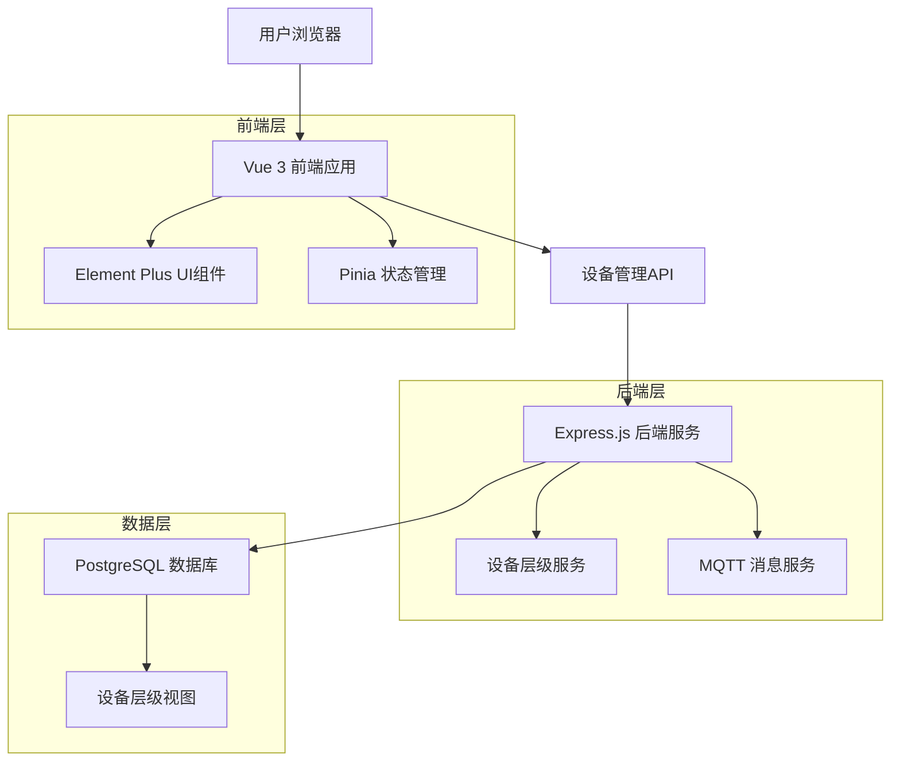
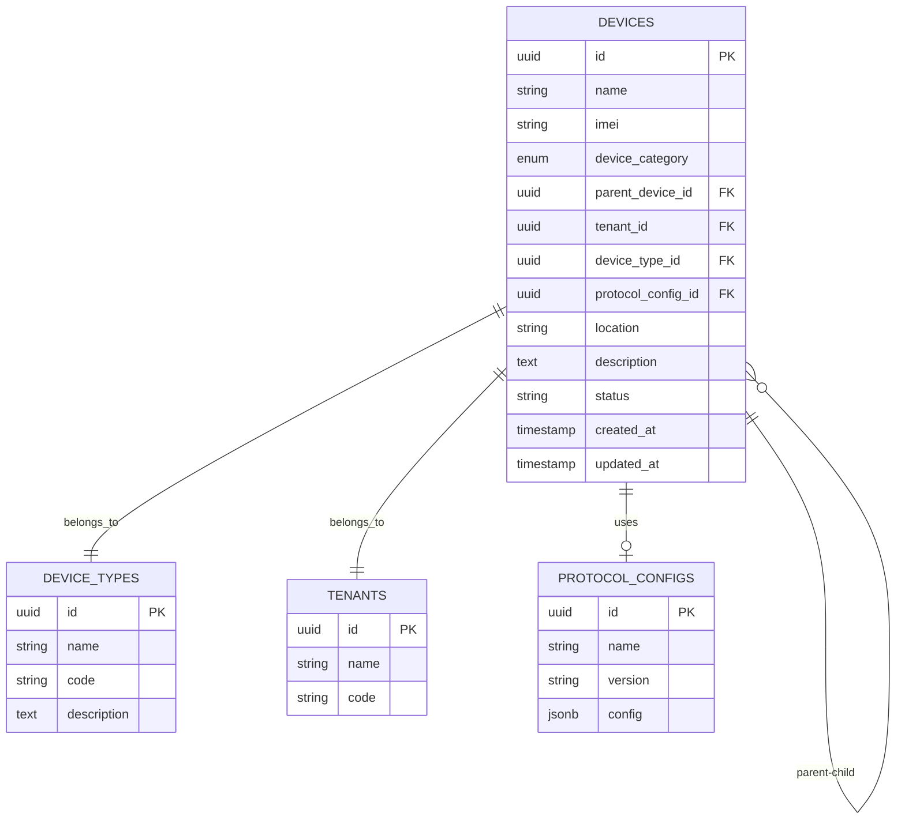

# 设备管理子设备功能技术架构文档

## 1. 架构设计



## 2. 技术描述

- **前端**: Vue 3 + Element Plus + Pinia + Vue Router 4 + Vite
- **后端**: Express.js + Sequelize ORM + MQTT
- **数据库**: PostgreSQL (现有)
- **实时通信**: WebSocket + MQTT

## 3. 路由定义

| 路由 | 用途 |
|------|------|
| /device-management | 设备管理主页面，显示设备列表和层级关系 |
| /device-management/add | 添加设备页面，支持设备分类和父设备选择 |
| /device-management/edit/:id | 编辑设备页面，可修改设备层级关系 |
| /device-management/tree | 设备层级树形视图页面 |
| /device-management/:id/children | 子设备管理页面，管理特定设备的子设备 |

## 4. API定义

### 4.1 设备管理核心API

**获取设备列表（支持层级）**
```
GET /api/devices
```

请求参数:
| 参数名 | 参数类型 | 是否必需 | 描述 |
|--------|----------|----------|------|
| include_hierarchy | boolean | false | 是否包含层级关系信息 |
| category | string | false | 设备分类筛选 (standalone/gateway/sub_device) |
| parent_id | string | false | 父设备ID筛选 |
| tenant_id | string | false | 租户ID筛选 |

响应:
| 参数名 | 参数类型 | 描述 |
|--------|----------|------|
| devices | array | 设备列表 |
| total | number | 设备总数 |
| hierarchy | object | 层级关系信息 |

示例响应:
```json
{
  "devices": [
    {
      "id": "uuid-1",
      "name": "集中器-01",
      "imei": "866123456789012",
      "device_category": "gateway",
      "parent_device_id": null,
      "children_count": 5,
      "status": "online"
    }
  ],
  "total": 1,
  "hierarchy": {
    "max_depth": 2,
    "gateway_count": 1,
    "sub_device_count": 5
  }
}
```

**创建设备**
```
POST /api/devices
```

请求:
| 参数名 | 参数类型 | 是否必需 | 描述 |
|--------|----------|----------|------|
| name | string | true | 设备名称 |
| imei | string | false | 设备IMEI |
| device_category | string | true | 设备分类 |
| parent_device_id | string | false | 父设备ID（子设备必需） |
| tenant_id | string | true | 租户ID |
| device_type_id | string | true | 设备类型ID |

**获取设备树形结构**
```
GET /api/devices/tree
```

响应:
```json
{
  "tree": [
    {
      "id": "uuid-1",
      "name": "集中器-01",
      "device_category": "gateway",
      "children": [
        {
          "id": "uuid-2",
          "name": "温控器-01",
          "device_category": "sub_device",
          "parent_device_id": "uuid-1"
        }
      ]
    }
  ]
}
```

**获取可用父设备列表**
```
GET /api/devices/gateways
```

响应:
| 参数名 | 参数类型 | 描述 |
|--------|----------|------|
| gateways | array | 可作为父设备的网关设备列表 |

### 4.2 子设备管理API

**获取子设备列表**
```
GET /api/devices/:id/children
```

**批量添加子设备**
```
POST /api/devices/:id/children/batch
```

请求:
```json
{
  "devices": [
    {
      "name": "温控器-01",
      "imei": "864123456789001",
      "device_type_id": "uuid-type-1"
    }
  ]
}
```

## 5. 数据模型

### 5.1 设备层级关系模型



### 5.2 数据定义语言

**设备表增强（基于现有表结构）**
```sql
-- 确保设备分类字段存在
ALTER TABLE devices 
ADD COLUMN IF NOT EXISTS device_category VARCHAR(20) DEFAULT 'standalone' 
CHECK (device_category IN ('standalone', 'gateway', 'sub_device'));

-- 确保父设备关联字段存在
ALTER TABLE devices 
ADD COLUMN IF NOT EXISTS parent_device_id UUID REFERENCES devices(id);

-- 创建设备层级关系索引
CREATE INDEX IF NOT EXISTS idx_devices_parent_device_id ON devices(parent_device_id);
CREATE INDEX IF NOT EXISTS idx_devices_category ON devices(device_category);
CREATE INDEX IF NOT EXISTS idx_devices_tenant_category ON devices(tenant_id, device_category);

-- 创建设备层级约束
ALTER TABLE devices ADD CONSTRAINT IF NOT EXISTS check_device_hierarchy 
CHECK (
    (device_category = 'sub_device' AND parent_device_id IS NOT NULL) OR
    (device_category = 'gateway' AND parent_device_id IS NULL) OR
    (device_category = 'standalone' AND parent_device_id IS NULL)
);

-- 创建设备层级查询视图
CREATE OR REPLACE VIEW device_hierarchy_view AS
WITH RECURSIVE device_tree AS (
    -- 根节点（网关设备和独立设备）
    SELECT 
        d.id, d.name, d.imei, d.device_category, d.parent_device_id,
        d.tenant_id, d.status, d.location, d.created_at,
        0 as level, 
        ARRAY[d.id] as path,
        d.name as root_name,
        dt.name as device_type_name,
        t.name as tenant_name
    FROM devices d
    LEFT JOIN device_types dt ON d.device_type_id = dt.id
    LEFT JOIN tenants t ON d.tenant_id = t.id
    WHERE d.parent_device_id IS NULL
    
    UNION ALL
    
    -- 子节点
    SELECT 
        d.id, d.name, d.imei, d.device_category, d.parent_device_id,
        d.tenant_id, d.status, d.location, d.created_at,
        tree.level + 1,
        tree.path || d.id,
        tree.root_name,
        dt.name as device_type_name,
        t.name as tenant_name
    FROM devices d
    JOIN device_tree tree ON d.parent_device_id = tree.id
    LEFT JOIN device_types dt ON d.device_type_id = dt.id
    LEFT JOIN tenants t ON d.tenant_id = t.id
    WHERE NOT d.id = ANY(tree.path) -- 防止循环引用
)
SELECT * FROM device_tree
ORDER BY level, created_at;

-- 创建设备统计视图
CREATE OR REPLACE VIEW device_statistics_view AS
SELECT 
    d.id,
    d.name,
    d.device_category,
    CASE 
        WHEN d.device_category = 'gateway' THEN 
            (SELECT COUNT(*) FROM devices WHERE parent_device_id = d.id)
        ELSE 0 
    END as children_count,
    CASE 
        WHEN d.device_category = 'sub_device' THEN 
            (SELECT name FROM devices WHERE id = d.parent_device_id)
        ELSE NULL 
    END as parent_name
FROM devices d;

-- 初始化示例数据
INSERT INTO devices (name, imei, device_category, tenant_id, device_type_id, location, description) 
VALUES 
    ('集中器-示例-01', '866661074511001', 'gateway', 
     (SELECT id FROM tenants LIMIT 1), 
     (SELECT id FROM device_types WHERE name LIKE '%集中器%' LIMIT 1),
     '办公楼1层', '示例集中器设备'),
    ('温控器-示例-01', '864661074511001', 'sub_device', 
     (SELECT id FROM tenants LIMIT 1), 
     (SELECT id FROM device_types WHERE name LIKE '%温控%' LIMIT 1),
     '办公楼1层-会议室A', '示例温控器设备')
ON CONFLICT (imei) DO NOTHING;

-- 建立父子关系
UPDATE devices 
SET parent_device_id = (SELECT id FROM devices WHERE imei = '866661074511001')
WHERE imei = '864661074511001';
```

## 6. 前端组件架构

### 6.1 组件层级结构

```
DeviceManagement/
├── DeviceList.vue              # 设备列表主组件
├── DeviceTree.vue              # 设备树形视图组件
├── DeviceForm.vue              # 设备添加/编辑表单
├── SubDeviceManager.vue        # 子设备管理组件
├── DeviceHierarchyCard.vue     # 设备层级关系卡片
└── components/
    ├── DeviceTypeSelector.vue  # 设备类型选择器
    ├── ParentDeviceSelector.vue # 父设备选择器
    ├── DeviceStatusTag.vue     # 设备状态标签
    └── DeviceActionButtons.vue # 设备操作按钮组
```

### 6.2 状态管理结构

```javascript
// stores/deviceStore.js
export const useDeviceStore = defineStore('device', {
  state: () => ({
    devices: [],
    deviceTree: [],
    currentDevice: null,
    loading: false,
    filters: {
      category: '',
      status: '',
      tenantId: '',
      parentId: ''
    }
  }),
  
  actions: {
    async fetchDevices(params = {}) {
      // 获取设备列表
    },
    
    async fetchDeviceTree() {
      // 获取设备树形结构
    },
    
    async createDevice(deviceData) {
      // 创建设备
    },
    
    async updateDevice(id, deviceData) {
      // 更新设备
    },
    
    async deleteDevice(id) {
      // 删除设备
    },
    
    async fetchSubDevices(parentId) {
      // 获取子设备列表
    }
  }
})
```

## 7. 实现计划

### 阶段一：基础功能实现（1-2周）
1. 数据库结构完善和视图创建
2. 后端API接口开发
3. 前端设备分类选择功能
4. 父设备选择和关联功能

### 阶段二：界面优化（1周）
1. 设备列表层级显示
2. 树形视图组件开发
3. 子设备管理页面
4. 用户界面优化

### 阶段三：功能增强（1周）
1. 批量操作功能
2. 设备层级关系验证
3. 实时状态更新
4. 移动端适配

每个阶段完成后进行测试和用户反馈收集，确保功能的稳定性和易用性。