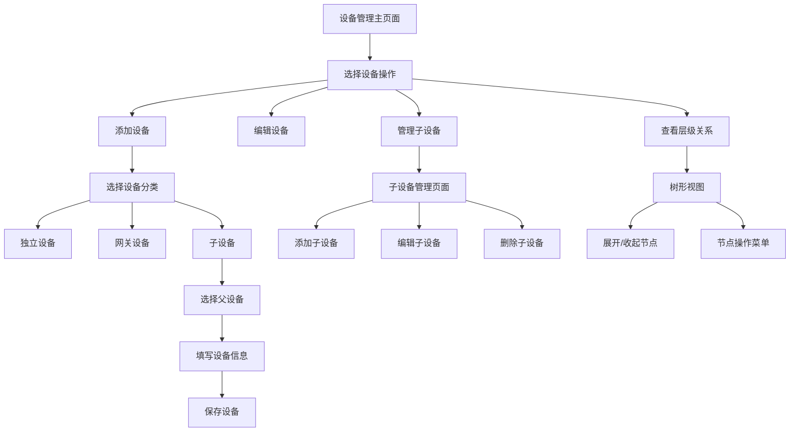

# 设备管理子设备功能需求文档

## 1. 产品概述

本需求旨在为IoT设备管理系统增加子设备管理功能，支持集中器设备管理多个子设备（如温控器）的层级关系。通过直观的界面展示和管理设备的父子关系，提升设备管理的效率和用户体验。

该功能将解决当前系统中设备层级关系不够直观、子设备管理不便的问题，为用户提供更完善的设备管理体验。

## 2. 核心功能

### 2.1 用户角色

| 角色 | 权限说明 | 核心功能 |
|------|----------|----------|
| 系统管理员 | 完整的设备管理权限 | 可管理所有租户的设备层级关系，创建、编辑、删除任意设备 |
| 租户管理员 | 租户内设备管理权限 | 可管理本租户内的设备层级关系，添加子设备到集中器 |
| 普通用户 | 查看和基础操作权限 | 可查看设备层级关系，执行基础的设备操作 |

### 2.2 功能模块

本功能主要包含以下页面和模块：

1. **设备管理主页面**：设备列表展示、层级关系显示、设备操作入口
2. **设备添加页面**：支持选择设备分类、父设备关联的设备创建功能
3. **子设备管理页面**：专门管理某个集中器下的所有子设备
4. **设备层级树形视图**：以树形结构展示设备的层级关系

### 2.3 页面详情

| 页面名称 | 模块名称 | 功能描述 |
|----------|----------|----------|
| 设备管理主页面 | 设备列表模块 | 显示所有设备，支持层级缩进展示父子关系 |
| 设备管理主页面 | 设备分类筛选 | 按设备分类（独立设备、网关设备、子设备）筛选显示 |
| 设备管理主页面 | 层级操作按钮 | 展开/收起子设备列表，查看子设备详情 |
| 设备添加/编辑页面 | 设备分类选择 | 选择设备类型：独立设备、网关设备、子设备 |
| 设备添加/编辑页面 | 父设备选择 | 当选择子设备时，显示可选的父设备（网关设备）列表 |
| 设备添加/编辑页面 | 设备信息表单 | 设备名称、IMEI、位置等基础信息录入 |
| 子设备管理页面 | 子设备列表 | 显示某个集中器下的所有子设备 |
| 子设备管理页面 | 批量操作 | 支持批量添加、删除、配置子设备 |
| 设备层级树形视图 | 树形结构展示 | 以树形图方式展示完整的设备层级关系 |
| 设备层级树形视图 | 节点操作 | 在树形节点上直接进行设备操作（编辑、删除、添加子设备） |

## 3. 核心流程

### 管理员设备管理流程
1. 登录系统进入设备管理页面
2. 查看设备列表，可按分类筛选（独立设备/网关设备/子设备）
3. 点击"添加设备"创建新设备
4. 选择设备分类，如选择"子设备"则需选择父设备
5. 填写设备信息并保存
6. 在设备列表中查看层级关系，可展开/收起子设备

### 子设备管理流程
1. 在设备列表中选择网关设备
2. 点击"管理子设备"进入子设备管理页面
3. 查看当前子设备列表
4. 添加新的子设备或编辑现有子设备
5. 配置子设备的连接参数和协议信息



## 4. 用户界面设计

### 4.1 设计风格
- **主色调**：#409EFF（Element Plus 主蓝色）、#67C23A（成功绿色）
- **辅助色**：#E6A23C（警告橙色）、#F56C6C（危险红色）、#909399（信息灰色）
- **按钮样式**：圆角按钮，支持图标+文字组合
- **字体**：14px 主要文字，12px 辅助信息，16px 标题
- **布局风格**：卡片式布局，左侧树形导航，右侧详情面板
- **图标风格**：Element Plus 内置图标，简洁现代

### 4.2 页面设计概览

| 页面名称 | 模块名称 | UI元素 |
|----------|----------|--------|
| 设备管理主页面 | 搜索筛选栏 | 设备名称搜索框、设备分类下拉选择、状态筛选、租户筛选 |
| 设备管理主页面 | 设备列表表格 | 层级缩进显示、设备图标、展开/收起按钮、状态标签、操作按钮组 |
| 设备管理主页面 | 操作工具栏 | 添加设备按钮、批量操作按钮、视图切换按钮（列表/树形） |
| 设备添加页面 | 设备分类选择 | 单选按钮组：独立设备/网关设备/子设备，带图标和说明 |
| 设备添加页面 | 父设备选择 | 下拉选择框，仅显示网关类型设备，支持搜索 |
| 设备添加页面 | 基础信息表单 | 设备名称、IMEI、位置、描述等输入框，表单验证提示 |
| 子设备管理页面 | 父设备信息卡片 | 显示集中器设备的基本信息、状态、子设备数量统计 |
| 子设备管理页面 | 子设备列表 | 简化的设备列表，专注于子设备管理操作 |
| 树形视图页面 | 设备层级树 | 可展开的树形结构，节点显示设备图标、名称、状态 |
| 树形视图页面 | 右键菜单 | 添加子设备、编辑设备、删除设备、查看详情等操作 |

### 4.3 响应式设计
- **桌面优先**：主要针对桌面端管理界面设计
- **平板适配**：支持平板横屏使用，调整布局比例
- **移动端优化**：提供简化的移动端视图，重点功能保留

## 5. 技术架构

### 5.1 前端技术栈
- **框架**：Vue 3 + Composition API
- **UI组件库**：Element Plus
- **状态管理**：Pinia
- **路由**：Vue Router 4
- **HTTP客户端**：Axios
- **构建工具**：Vite

### 5.2 后端API接口

#### 设备管理相关接口
```
GET /api/devices - 获取设备列表（支持层级查询）
POST /api/devices - 创建新设备
PUT /api/devices/:id - 更新设备信息
DELETE /api/devices/:id - 删除设备
GET /api/devices/:id/children - 获取子设备列表
POST /api/devices/:id/children - 为设备添加子设备
```

#### 设备层级关系接口
```
GET /api/devices/tree - 获取设备树形结构
GET /api/devices/gateways - 获取可作为父设备的网关设备列表
POST /api/devices/batch - 批量操作设备
```

### 5.3 数据库设计

#### 设备表结构增强
```sql
-- 设备表（已存在，需要确保字段完整）
CREATE TABLE devices (
    id UUID PRIMARY KEY DEFAULT gen_random_uuid(),
    name VARCHAR(255) NOT NULL,
    imei VARCHAR(50) UNIQUE,
    device_category VARCHAR(20) DEFAULT 'standalone' 
        CHECK (device_category IN ('standalone', 'gateway', 'sub_device')),
    parent_device_id UUID REFERENCES devices(id),
    tenant_id UUID REFERENCES tenants(id),
    device_type_id UUID REFERENCES device_types(id),
    manufacturer_code VARCHAR(20),
    protocol_config_id UUID REFERENCES protocol_configs(id),
    location VARCHAR(500),
    description TEXT,
    status VARCHAR(20) DEFAULT 'offline',
    created_at TIMESTAMP WITH TIME ZONE DEFAULT NOW(),
    updated_at TIMESTAMP WITH TIME ZONE DEFAULT NOW()
);

-- 设备层级关系索引
CREATE INDEX idx_devices_parent_device_id ON devices(parent_device_id);
CREATE INDEX idx_devices_category ON devices(device_category);
CREATE INDEX idx_devices_tenant_category ON devices(tenant_id, device_category);
```

#### 设备层级视图
```sql
-- 创建设备层级查询视图
CREATE VIEW device_hierarchy AS
WITH RECURSIVE device_tree AS (
    -- 根节点（网关设备和独立设备）
    SELECT 
        id, name, imei, device_category, parent_device_id,
        tenant_id, status, 0 as level, 
        ARRAY[id] as path,
        name as root_name
    FROM devices 
    WHERE parent_device_id IS NULL
    
    UNION ALL
    
    -- 子节点
    SELECT 
        d.id, d.name, d.imei, d.device_category, d.parent_device_id,
        d.tenant_id, d.status, dt.level + 1,
        dt.path || d.id,
        dt.root_name
    FROM devices d
    JOIN device_tree dt ON d.parent_device_id = dt.id
)
SELECT * FROM device_tree;
```

## 6. 实现优先级

### 第一阶段（核心功能）
1. 设备分类选择功能
2. 父设备选择和关联
3. 设备列表层级显示
4. 基础的子设备添加功能

### 第二阶段（增强功能）
1. 树形视图展示
2. 子设备管理专用页面
3. 批量操作功能
4. 设备层级关系验证

### 第三阶段（优化功能）
1. 拖拽式设备层级调整
2. 设备层级关系图表展示
3. 移动端适配优化
4. 高级筛选和搜索功能