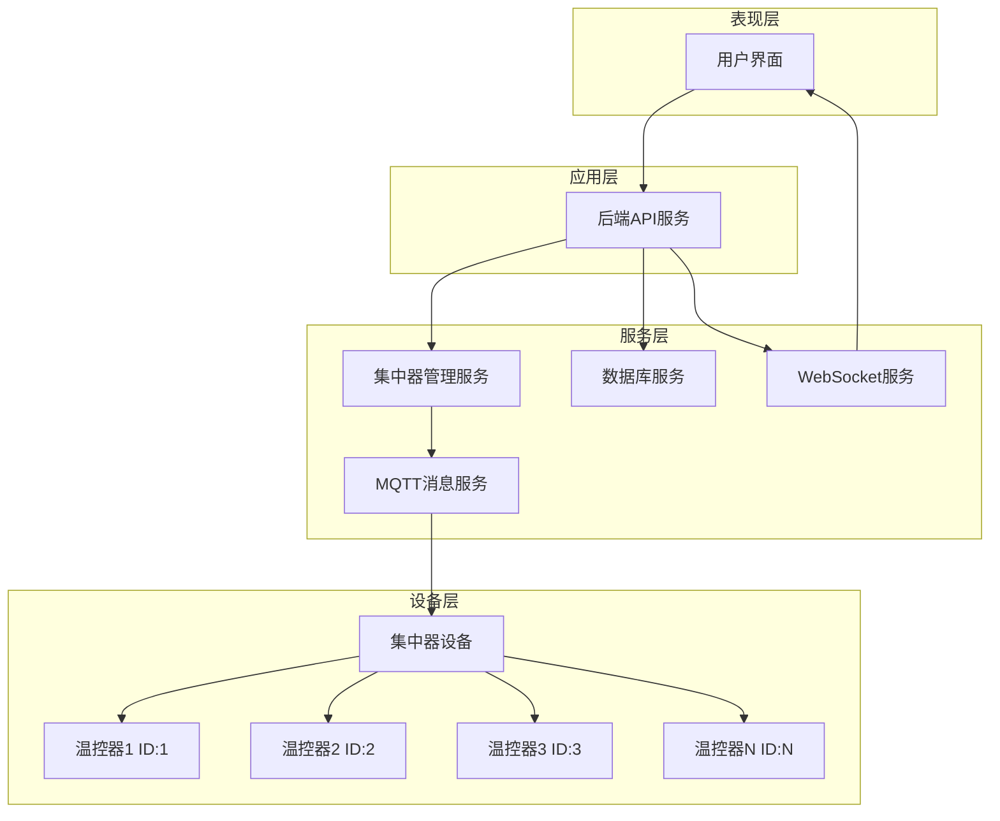
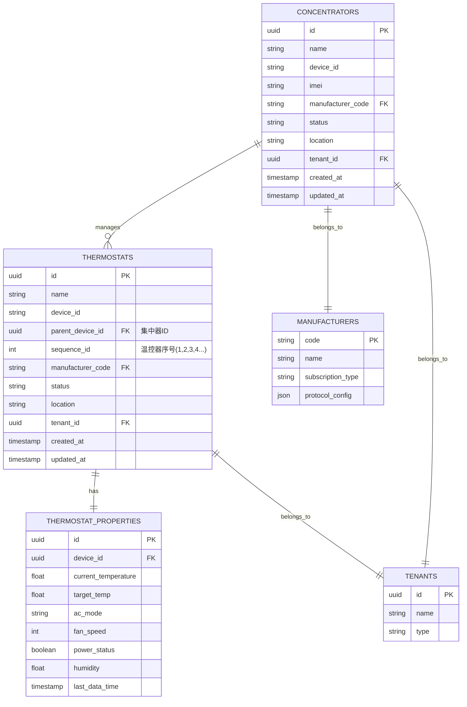
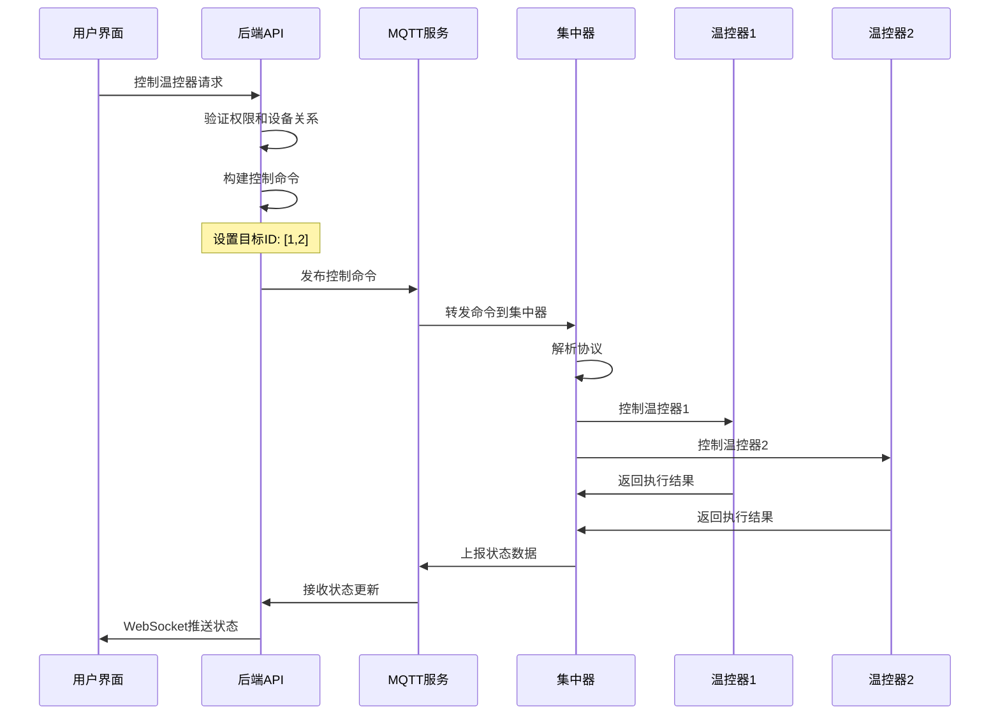

# IoT温控器集中器管理系统技术架构文档

## 1. 架构设计



## 2. 技术描述

### 2.1 核心技术栈
- **后端**: Node.js + Express.js
- **数据库**: PostgreSQL
- **消息通信**: MQTT (Mosquitto)
- **实时通信**: WebSocket
- **设备协议**: 厂商自定义协议 + JSON格式
- **权限管理**: JWT + 基于角色的访问控制(RBAC)

### 2.2 关键服务组件
- **ThermostatService**: 温控器设备管理服务
- **MQTTService**: MQTT消息发布订阅服务
- **WebSocketService**: 实时数据推送服务
- **DatabaseService**: 数据持久化服务

## 3. 集中器与温控器层级关系管理

### 3.1 数据模型设计



### 3.2 层级关系实现

#### 集中器注册
```javascript
// 集中器设备注册
async addConcentratorDevice(deviceData, tenantId, userId) {
  const deviceQuery = `
    INSERT INTO devices (name, device_id, device_type_id, status, location, 
                        tenant_id, created_by, manufacturer_code)
    VALUES ($1, $2, $3, $4, $5, $6, $7, $8)
    RETURNING id
  `;
  // 设备类型为'温控器集中器'
}
```

#### 温控器关联集中器
```javascript
// 温控器设备添加到集中器
async addThermostatToConcentrator(thermostatData, concentratorId, tenantId) {
  // 设置父设备关系
  const updateParentQuery = `
    UPDATE devices 
    SET parent_device_id = $1, updated_at = NOW()
    WHERE id = $2
  `;
  
  // 分配序号ID (1,2,3,4...)
  const sequenceId = await this.getNextSequenceId(concentratorId);
}
```

## 4. 温控器ID号分配和管理机制

### 4.1 序号分配策略

```javascript
/**
 * 获取集中器下一个可用的温控器序号
 */
async getNextSequenceId(concentratorId) {
  const query = `
    SELECT COALESCE(MAX(sequence_id), 0) + 1 as next_id
    FROM devices 
    WHERE parent_device_id = $1 AND device_type_id = (
      SELECT id FROM device_types WHERE name = '空调温控器'
    )
  `;
  
  const result = await db.query(query, [concentratorId]);
  return result.rows[0].next_id;
}

/**
 * 验证序号唯一性
 */
async validateSequenceId(concentratorId, sequenceId) {
  const query = `
    SELECT COUNT(*) as count
    FROM devices 
    WHERE parent_device_id = $1 AND sequence_id = $2
  `;
  
  const result = await db.query(query, [concentratorId, sequenceId]);
  return result.rows[0].count === 0;
}
```

### 4.2 ID号管理规则

1. **自动分配**: 系统自动为新添加的温控器分配序号(1,2,3,4...)
2. **唯一性保证**: 同一集中器下的温控器序号不能重复
3. **回收机制**: 删除温控器后，序号可以被重新分配
4. **最大限制**: 单个集中器最多支持255个温控器(协议限制)

## 5. 通信流程设计

### 5.1 MQTT主题结构

```
厂商订阅主题格式:
/{manufacturer_code}/{subscription_type}/{concentrator_imei}/command
/{manufacturer_code}/{subscription_type}/{concentrator_imei}/data

示例:
/HAIER/CLOUD/860123456789012/command  # 命令下发
/HAIER/CLOUD/860123456789012/data     # 数据上报
```

### 5.2 控制命令协议

```javascript
/**
 * 温控器控制命令格式
 */
const controlCommand = {
  header: {
    messageId: "uuid",
    timestamp: "2024-01-01T00:00:00Z",
    version: "1.0"
  },
  body: {
    id: [1, 2, 3],  // 目标温控器ID数组
    setOn: 1,       // 开关控制 (1:开, 0:关)
    setTemp: 24,    // 目标温度
    setMode: 2,     // 模式 (0:送风, 1:制热, 2:制冷, 3:除湿)
    setFan: 1       // 风速 (0:自动, 1:低速, 2:中速, 3:高速)
  }
};

/**
 * 构建MQTT主题
 */
buildMqttTopic(device) {
  return `/${device.manufacturer_code}/${device.subscription_type}/${device.imei}/command`;
}
```

### 5.3 设备控制流程



## 6. 批量操作和单独控制

### 6.1 单独控制实现

```javascript
/**
 * 单个温控器控制
 */
async controlSingleThermostat(deviceId, command, tenantId, userId) {
  // 获取设备信息和集中器关系
  const device = await this.getThermostatDevice(deviceId, tenantId);
  
  // 构建控制命令，指定单个ID
  const controlCommand = this.buildControlCommand(command);
  controlCommand.body.id = [device.sequence_id]; // 单个温控器ID
  
  // 发送MQTT命令到集中器
  const topic = this.buildMqttTopic(device.concentrator);
  await mqttService.publish(topic, JSON.stringify(controlCommand));
}
```

### 6.2 批量控制实现

```javascript
/**
 * 批量温控器控制
 */
async batchControlThermostats(deviceIds, command, tenantId, userId) {
  // 按集中器分组
  const devicesByConcentrator = await this.groupDevicesByConcentrator(deviceIds, tenantId);
  
  const results = [];
  
  for (const [concentratorId, devices] of devicesByConcentrator) {
    try {
      // 构建批量控制命令
      const controlCommand = this.buildControlCommand(command);
      controlCommand.body.id = devices.map(d => d.sequence_id); // 多个温控器ID
      
      // 发送到对应集中器
      const concentrator = devices[0].concentrator;
      const topic = this.buildMqttTopic(concentrator);
      await mqttService.publish(topic, JSON.stringify(controlCommand));
      
      results.push({
        concentratorId,
        deviceIds: devices.map(d => d.id),
        status: 'success'
      });
    } catch (error) {
      results.push({
        concentratorId,
        deviceIds: devices.map(d => d.id),
        status: 'error',
        error: error.message
      });
    }
  }
  
  return results;
}
```

### 6.3 集中器级别批量操作

```javascript
/**
 * 集中器下所有温控器批量控制
 */
async controlAllThermostatsInConcentrator(concentratorId, command, tenantId, userId) {
  // 获取集中器下所有温控器
  const thermostats = await this.getThermostatsByConcentrator(concentratorId, tenantId);
  
  // 构建全部控制命令
  const controlCommand = this.buildControlCommand(command);
  controlCommand.body.id = thermostats.map(t => t.sequence_id); // 所有温控器ID
  
  // 发送控制命令
  const concentrator = await this.getConcentratorDevice(concentratorId, tenantId);
  const topic = this.buildMqttTopic(concentrator);
  await mqttService.publish(topic, JSON.stringify(controlCommand));
}
```

## 7. 设备状态同步和数据上报机制

### 7.1 数据上报协议

```javascript
/**
 * 设备状态上报数据格式
 */
const statusReport = {
  header: {
    messageId: "uuid",
    timestamp: "2024-01-01T00:00:00Z",
    type: "status_report"
  },
  body: {
    concentratorId: "集中器设备ID",
    thermostats: [
      {
        id: 1,  // 温控器序号
        temperature: 25.5,
        targetTemp: 24.0,
        mode: 2,
        fanSpeed: 1,
        powerStatus: 1,
        humidity: 60.5,
        online: true
      },
      {
        id: 2,
        temperature: 26.0,
        targetTemp: 25.0,
        mode: 2,
        fanSpeed: 2,
        powerStatus: 1,
        humidity: 58.0,
        online: true
      }
    ]
  }
};
```

### 7.2 状态同步服务

```javascript
/**
 * 处理设备状态上报
 */
async processStatusReport(topic, message) {
  try {
    const data = JSON.parse(message);
    const concentratorImei = this.extractImeiFromTopic(topic);
    
    // 查找集中器设备
    const concentrator = await this.getConcentratorByImei(concentratorImei);
    
    // 更新温控器状态
    for (const thermostatData of data.body.thermostats) {
      await this.updateThermostatStatus(
        concentrator.id, 
        thermostatData.id, 
        thermostatData
      );
    }
    
    // WebSocket实时推送
    await this.broadcastStatusUpdate(concentrator.tenant_id, data);
    
  } catch (error) {
    logger.error('处理状态上报失败:', error);
  }
}

/**
 * 更新温控器状态
 */
async updateThermostatStatus(concentratorId, sequenceId, statusData) {
  const query = `
    UPDATE thermostat_properties tp
    SET current_temperature = $1,
        target_temp = $2,
        ac_mode = $3,
        fan_speed = $4,
        power_status = $5,
        humidity = $6,
        last_data_time = NOW()
    FROM devices d
    WHERE tp.device_id = d.id 
      AND d.parent_device_id = $7 
      AND d.sequence_id = $8
  `;
  
  await db.query(query, [
    statusData.temperature,
    statusData.targetTemp,
    this.convertModeFromProtocol(statusData.mode),
    statusData.fanSpeed,
    statusData.powerStatus === 1,
    statusData.humidity,
    concentratorId,
    sequenceId
  ]);
}
```

### 7.3 离线检测机制

```javascript
/**
 * 设备离线检测
 */
async checkDeviceOnlineStatus() {
  const offlineThreshold = 5 * 60 * 1000; // 5分钟无数据视为离线
  
  const query = `
    UPDATE devices d
    SET status = 'offline'
    FROM thermostat_properties tp
    WHERE d.id = tp.device_id
      AND d.status = 'online'
      AND (tp.last_data_time IS NULL OR tp.last_data_time < NOW() - INTERVAL '5 minutes')
  `;
  
  await db.query(query);
}
```

## 8. 权限管理和安全控制

### 8.1 权限验证中间件

```javascript
/**
 * 温控器设备权限验证
 */
const checkThermostatAccess = async (req, res, next) => {
  const deviceId = req.params.deviceId;
  const userId = req.user.id;
  const userRole = req.user.role;
  const userTenantId = req.user.tenant_id;
  
  // 获取设备信息和集中器关系
  const device = await getThermostatWithConcentrator(deviceId);
  
  if (!device) {
    return res.status(404).json({
      success: false,
      message: '设备不存在'
    });
  }
  
  // 超级管理员权限
  if (userRole === 'super_admin') {
    req.device = device;
    return next();
  }
  
  // 租户权限验证
  if (device.tenant_id !== userTenantId) {
    return res.status(403).json({
      success: false,
      message: '无权限访问该设备'
    });
  }
  
  // 集中器状态验证
  if (device.concentrator_id && device.concentrator_status !== 'online') {
    return res.status(400).json({
      success: false,
      message: '集中器离线，无法控制温控器'
    });
  }
  
  req.device = device;
  next();
};
```

### 8.2 集中器关联关系验证

```javascript
/**
 * 验证集中器关联关系
 */
const checkConcentratorRelation = async (req, res, next) => {
  const device = req.device;
  
  if (!device.concentrator_id) {
    return next(); // 非集中器管理的设备直接通过
  }
  
  // 查询集中器关联关系
  const relationQuery = `
    SELECT c.id, c.name, c.status, c.tenant_id
    FROM devices c
    WHERE c.id = $1 AND c.device_type_id = (
      SELECT id FROM device_types WHERE name = '温控器集中器'
    )
  `;
  
  const result = await db.query(relationQuery, [device.concentrator_id]);
  
  if (result.rows.length === 0) {
    return res.status(400).json({
      success: false,
      message: '集中器设备不存在'
    });
  }
  
  const concentrator = result.rows[0];
  
  // 验证集中器状态
  if (concentrator.status !== 'online') {
    return res.status(400).json({
      success: false,
      message: `集中器状态异常: ${concentrator.status}`
    });
  }
  
  // 验证租户一致性
  if (concentrator.tenant_id !== device.tenant_id) {
    return res.status(400).json({
      success: false,
      message: '集中器与温控器不属于同一租户'
    });
  }
  
  req.concentrator = concentrator;
  next();
};
```

### 8.3 操作日志记录

```javascript
/**
 * 记录设备控制日志
 */
async logControlAction(deviceId, userId, action, commandData, result) {
  const query = `
    INSERT INTO thermostat_control_logs (
      device_id, user_id, control_type, command_data, 
      result, success, created_at
    )
    VALUES ($1, $2, $3, $4, $5, $6, NOW())
  `;
  
  await db.query(query, [
    deviceId,
    userId,
    action,
    JSON.stringify(commandData),
    JSON.stringify(result),
    result.success || false
  ]);
}
```

## 9. 路由定义

| 路由 | 方法 | 功能描述 |
|------|------|----------|
| `/api/thermostats/concentrators` | GET | 获取集中器列表 |
| `/api/thermostats/concentrators/:id/thermostats` | GET | 获取集中器下的温控器列表 |
| `/api/thermostats/:id` | GET | 获取单个温控器详情 |
| `/api/thermostats` | POST | 添加温控器到集中器 |
| `/api/thermostats/:id` | DELETE | 删除温控器 |
| `/api/thermostats/:id/power` | POST | 单个温控器开关控制 |
| `/api/thermostats/:id/temperature` | POST | 单个温控器温度设置 |
| `/api/thermostats/:id/mode` | POST | 单个温控器模式设置 |
| `/api/thermostats/batch/power` | POST | 批量温控器开关控制 |
| `/api/thermostats/batch/temperature` | POST | 批量温控器温度设置 |
| `/api/thermostats/batch/mode` | POST | 批量温控器模式设置 |
| `/api/thermostats/concentrators/:id/control-all` | POST | 集中器下全部温控器控制 |

## 10. 数据定义语言(DDL)

### 10.1 设备表结构

```sql
-- 设备表 (包含集中器和温控器)
CREATE TABLE devices (
    id UUID PRIMARY KEY DEFAULT gen_random_uuid(),
    name VARCHAR(255) NOT NULL,
    device_id VARCHAR(100) UNIQUE NOT NULL,
    device_type_id UUID NOT NULL REFERENCES device_types(id),
    parent_device_id UUID REFERENCES devices(id), -- 集中器ID
    sequence_id INTEGER, -- 温控器在集中器中的序号
    imei VARCHAR(20),
    manufacturer_code VARCHAR(50) NOT NULL,
    status VARCHAR(20) DEFAULT 'offline',
    location VARCHAR(255),
    tenant_id UUID NOT NULL REFERENCES tenants(id),
    created_by UUID REFERENCES users(id),
    created_at TIMESTAMP WITH TIME ZONE DEFAULT NOW(),
    updated_at TIMESTAMP WITH TIME ZONE DEFAULT NOW(),
    
    -- 确保同一集中器下序号唯一
    UNIQUE(parent_device_id, sequence_id)
);

-- 温控器属性表
CREATE TABLE thermostat_properties (
    id UUID PRIMARY KEY DEFAULT gen_random_uuid(),
    device_id UUID NOT NULL REFERENCES devices(id) ON DELETE CASCADE,
    current_temperature DECIMAL(5,2),
    target_temp DECIMAL(5,2),
    ac_mode VARCHAR(20) DEFAULT 'cool',
    fan_speed INTEGER DEFAULT 0,
    power_status BOOLEAN DEFAULT false,
    humidity DECIMAL(5,2),
    last_data_time TIMESTAMP WITH TIME ZONE,
    created_at TIMESTAMP WITH TIME ZONE DEFAULT NOW(),
    updated_at TIMESTAMP WITH TIME ZONE DEFAULT NOW()
);

-- 设备类型表
CREATE TABLE device_types (
    id UUID PRIMARY KEY DEFAULT gen_random_uuid(),
    name VARCHAR(100) NOT NULL UNIQUE,
    code VARCHAR(50) NOT NULL UNIQUE,
    description TEXT,
    created_at TIMESTAMP WITH TIME ZONE DEFAULT NOW()
);

-- 厂商表
CREATE TABLE manufacturers (
    code VARCHAR(50) PRIMARY KEY,
    name VARCHAR(255) NOT NULL,
    subscription_type VARCHAR(50) NOT NULL,
    protocol_config JSONB,
    created_at TIMESTAMP WITH TIME ZONE DEFAULT NOW()
);

-- 控制日志表
CREATE TABLE thermostat_control_logs (
    id UUID PRIMARY KEY DEFAULT gen_random_uuid(),
    device_id UUID NOT NULL REFERENCES devices(id),
    user_id UUID REFERENCES users(id),
    control_type VARCHAR(50) NOT NULL,
    command_data JSONB,
    result JSONB,
    success BOOLEAN DEFAULT false,
    created_at TIMESTAMP WITH TIME ZONE DEFAULT NOW()
);
```

### 10.2 索引创建

```sql
-- 设备相关索引
CREATE INDEX idx_devices_parent_device_id ON devices(parent_device_id);
CREATE INDEX idx_devices_tenant_id ON devices(tenant_id);
CREATE INDEX idx_devices_device_type_id ON devices(device_type_id);
CREATE INDEX idx_devices_status ON devices(status);
CREATE INDEX idx_devices_imei ON devices(imei);

-- 温控器属性索引
CREATE INDEX idx_thermostat_properties_device_id ON thermostat_properties(device_id);
CREATE INDEX idx_thermostat_properties_last_data_time ON thermostat_properties(last_data_time DESC);

-- 控制日志索引
CREATE INDEX idx_control_logs_device_id ON thermostat_control_logs(device_id);
CREATE INDEX idx_control_logs_user_id ON thermostat_control_logs(user_id);
CREATE INDEX idx_control_logs_created_at ON thermostat_control_logs(created_at DESC);
```

### 10.3 初始数据

```sql
-- 插入设备类型
INSERT INTO device_types (name, code, description) VALUES
('温控器集中器', 'THERMOSTAT_CONCENTRATOR', '温控器集中器设备'),
('空调温控器', 'AC_THERMOSTAT', '空调温控器设备');

-- 插入厂商信息
INSERT INTO manufacturers (code, name, subscription_type, protocol_config) VALUES
('HAIER', '海尔', 'CLOUD', '{"version": "1.0", "format": "json"}'),
('GREE', '格力', 'CLOUD', '{"version": "1.0", "format": "json"}'),
('MIDEA', '美的', 'CLOUD', '{"version": "1.0", "format": "json"}');
```

## 11. 部署和运维

### 11.1 系统监控

```javascript
/**
 * 系统健康检查
 */
async healthCheck() {
  const checks = {
    database: await this.checkDatabaseConnection(),
    mqtt: await this.checkMqttConnection(),
    concentrators: await this.checkConcentratorStatus(),
    thermostats: await this.checkThermostatStatus()
  };
  
  return {
    status: Object.values(checks).every(c => c.status === 'ok') ? 'healthy' : 'unhealthy',
    checks,
    timestamp: new Date().toISOString()
  };
}
```

### 11.2 性能优化建议

1. **数据库优化**
   - 使用连接池管理数据库连接
   - 定期清理历史日志数据
   - 优化查询索引

2. **MQTT优化**
   - 使用QoS 1确保消息可靠传输
   - 实现消息重试机制
   - 监控MQTT连接状态

3. **缓存策略**
   - 缓存设备状态信息
   - 缓存用户权限信息
   - 使用Redis提升响应速度

这个技术架构文档详细描述了通过集中器管理多个温控器的完整系统设计，包括设备层级关系、ID管理、通信协议、权限控制等核心功能的实现方案。