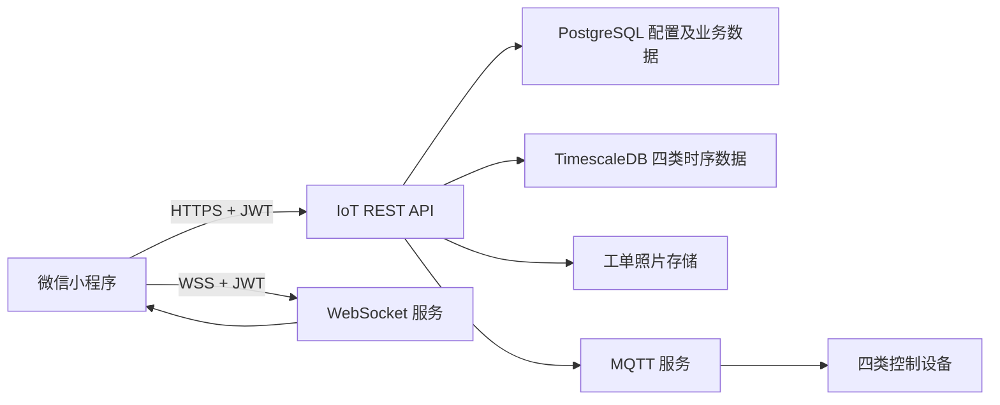
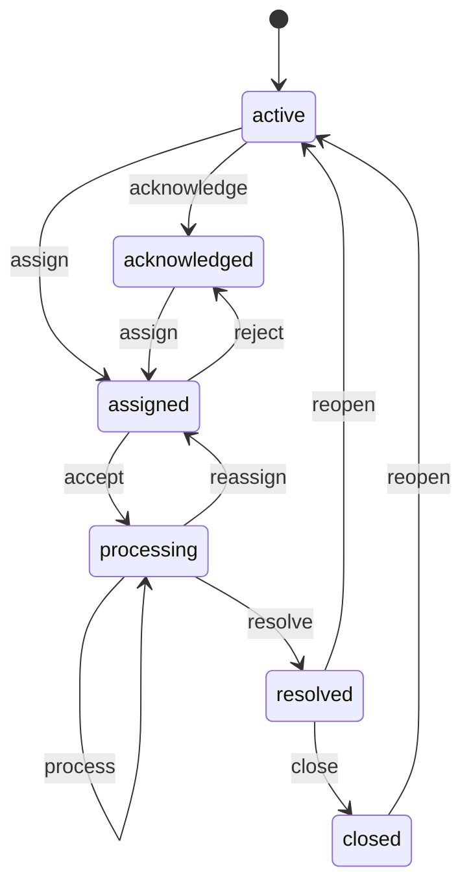

# 伯宁物联网微信小程序开发文档

> 文档版本：v0.2（首版实现）
> 编写日期：2026-07-26
> 对应服务端版本：v2.2 / `8533eff`
> 当前状态：首版业务代码已完成，等待正式小程序 AppID 和真机联调

## 1. 建设目标

微信小程序面向现场运维人员、租户管理员及分级管理用户，第一期实现以下功能：

1. 用户名和密码登录，沿用现有系统账号、角色和数据权限。
2. 控制四类设备：
   - 开关控制
   - 照明控制
   - 温控控制
   - 空调控制
3. 查看设备在线状态、运行状态和对应模块的电气数据。
4. 接收告警派单消息，完成接单、退回、处理、解决等工单流程。
5. 工单处理支持现场拍照和相册选图，支持多张图片。
6. 按租户、建筑、项目分组限制用户可见设备和工单。

第一期不在小程序中提供设备建档、厂商管理、协议配置、用户权限配置、系统配置和数据库运维功能。这些功能继续由 PC 管理端完成。

## 2. 基本原则

- 小程序只调用 HTTP API 和 WebSocket，不直接连接 MQTT Broker。
- 网关设备不允许加入任何控制模块，也不在小程序中显示控制入口。
- 设备控制必须由后端根据设备协议生成 JSON 或 Hex 指令，小程序不拼装厂商私有报文。
- HTTP 返回成功只表示命令已发送，不能直接认定设备已经执行。
- 控制完成后，通过设备状态接口或 WebSocket 上报确认最终状态。
- 四个控制模块分别读取各自的状态和电气数据，不交叉复用其他模块的数据模型。
- 客户端菜单控制只改善体验，最终权限必须由后端校验。

## 3. 技术方案

### 3.1 推荐技术栈

第一期建议采用微信原生小程序：

- TypeScript
- WXML / WXSS
- 微信开发者工具
- npm 构建
- 自建轻量状态管理，不引入大型跨端框架
- `wx.request` 调用 REST API
- `wx.connectSocket` 接收实时消息
- `wx.chooseMedia` 选择现场照片
- `wx.request` 发送包含多张照片的 `multipart/form-data`

选择原生小程序的原因是现场拍照、文件上传、权限授权、WebSocket 和发布审核都直接依赖微信能力，原生实现更容易定位问题。若后续明确还要同时发布 H5 或 App，再评估 uni-app。

### 3.2 总体结构



### 3.3 环境地址

当前局域网测试环境：

```text
API:       http://192.168.10.155/api
WebSocket: ws://192.168.10.155/ws
```

正式发布不能直接使用当前局域网 IP。需要准备备案域名、有效 HTTPS 证书，并在微信公众平台配置：

- request 合法域名
- uploadFile 合法域名
- downloadFile 合法域名
- socket 合法域名

正式地址统一为：

```text
Web:       https://bnyk.boningse.com
API:       https://bnyk.boningse.com/api
WebSocket: wss://bnyk.boningse.com/ws
```

开发者工具联调阶段可以临时关闭合法域名校验，但真机体验版和正式版必须使用 HTTPS/WSS 域名。

## 4. 用户、权限与数据范围

### 4.1 现有角色

| 角色 | 数据范围 |
|---|---|
| `admin` | 超级管理员，可查看和管理所有租户 |
| `tenant_admin` | 当前租户 |
| `user` | 当前租户，具体菜单受权限配置限制 |
| `building_user` | 当前租户下指定建筑 |
| `group_user` | 当前租户、建筑下指定项目分组 |

小程序不得通过自行传入 `tenantId` 扩大数据范围。服务端应以 Token 对应用户的租户、建筑和项目分组为准。

### 4.2 页面权限

登录后读取 `GET /api/auth/me` 返回的用户资料和 `profile.permissions`，按以下权限决定入口是否显示：

| 小程序入口 | 权限值 |
|---|---|
| 照明控制 | `lighting` |
| 开关控制 | `switch-control` |
| 温控控制 | `thermostat` |
| 空调控制 | `air-conditioner` |
| 告警工单 | `alarms` |

`admin` 和 `tenant_admin` 可按现有规则获得管理能力。普通处理人员只显示其有权访问的模块和工单。

### 4.3 正式开放前的权限整改

当前部分接口主要依赖登录状态和租户范围，尚未全部统一执行页面权限中间件。小程序正式对外发布前，后端应对四个控制模块逐个补齐 `requirePermission` 或等价校验，不能只依靠小程序隐藏按钮。

## 5. 页面结构

### 5.1 底部导航

| 导航 | 功能 |
|---|---|
| 控制 | 四个控制模块、设备状态概览 |
| 工单 | 待接单、处理中、已完成、全部工单 |
| 消息 | 派单、退回、处理状态变化消息 |
| 我的 | 用户资料、当前权限范围、修改密码、退出登录 |

### 5.2 页面清单

```text
pages/
├── login/index
├── control/index
├── switch/list
├── switch/detail
├── lighting/list
├── lighting/detail
├── thermostat/list
├── thermostat/detail
├── air-conditioner/list
├── air-conditioner/detail
├── work-order/list
├── work-order/detail
├── work-order/action
├── notification/list
└── profile/index
```

控制首页提供租户、建筑、项目分组和状态筛选。非 `admin` 用户不显示超出自身范围的筛选项。

## 6. 登录与会话

### 6.1 登录

```http
POST /api/auth/login
Content-Type: application/json

{
  "username": "operator",
  "password": "******"
}
```

成功后保存：

```text
data.token
data.refreshToken
data.user
```

存储键建议统一为：

```text
accessToken
refreshToken
userProfile
```

不得保存用户明文密码，不得在日志中输出 Token。

### 6.2 刷新 Token

```http
POST /api/auth/refresh
Content-Type: application/json

{
  "refreshToken": "<refreshToken>"
}
```

请求层遇到 `401` 时执行一次刷新。多个请求同时返回 `401` 时，只允许一个刷新请求运行，其他请求等待刷新结果，成功后再重放。

### 6.3 当前用户

```http
GET /api/auth/me
Authorization: Bearer <token>
```

启动小程序、切回前台和进入重要控制页面时，可读取一次当前用户信息，防止账号被停用或权限已调整但本地仍使用旧菜单。

### 6.4 后续微信账号绑定

第一期继续使用现有用户名和密码，不依赖微信身份。后续可增加：

```text
POST /api/auth/wechat/bind
POST /api/auth/wechat/login
DELETE /api/auth/wechat/bind
```

这三个接口目前尚未实现，不属于第一期阻塞项。

## 7. 项目范围筛选

| 用途 | 接口 |
|---|---|
| 建筑列表 | `GET /api/project-management/buildings` |
| 项目分组列表 | `GET /api/project-management/groups?buildingId=...` |

筛选顺序统一为：

```text
所属租户 -> 建筑 -> 项目分组 -> 设备状态
```

选择建筑后清空不属于该建筑的分组。小程序不提供新增、编辑和删除分组功能，分组继续由 PC 端项目管理页面维护。

## 8. 四个控制模块

### 8.1 通用交互

每个设备卡片至少显示：

- 设备名称
- 设备 ID 或 IMEI
- 建筑和项目分组
- 在线/离线状态
- 当前开关或运行状态
- 最后数据时间

控制按钮规则：

1. 设备离线时禁止发送控制命令。
2. 点击后立即进入“发送中”，防止重复点击。
3. 每次控制生成 UUID，放入 `X-Request-ID` 请求头。
4. HTTP 成功后显示“等待设备确认”。
5. 通过 WebSocket 或状态查询确认成功后更新界面。
6. 超时未确认时显示“命令已发送，设备暂未确认”，允许用户主动刷新。
7. 不进行无限自动重试，避免同一命令重复执行。

### 8.2 开关控制

设备列表：

```http
GET /api/switch-control
  ?page=1
  &pageSize=20
  &tenantId=
  &keyword=
  &status=
  &buildingId=
  &projectGroupId=
```

最新开关状态：

```http
GET /api/switch-control/:imei/status
```

控制单个开关：

```http
POST /api/switch-control/:deviceId/control
Content-Type: application/json

{
  "power_status": true
}
```

电气数据：

```text
GET /api/switch-control/:imei/electrical/latest
GET /api/switch-control/:imei/electrical/history
```

开关控制只有一个 `power_status`，不存在 `key1/key2/key3` 分路。照明控制的分路状态和控制命令不能用于开关控制。

卡片和详情页重点显示以下四项，保留两位小数：

| 参数 | 建议单位 |
|---|---|
| 累计电量 | kWh |
| 总功率 | W |
| 漏电电流 | mA |
| 频率 | Hz |

详情页可补充三相电压、电流和 A/B/C 相温度，但必须以独立的 `switch_electrical_measurements` 时序表实际返回字段为准。

### 8.3 照明控制

设备列表：

```http
GET /api/lighting-control
  ?page=1
  &pageSize=20
  &tenantId=
  &keyword=
  &device_type=照明开关
  &lighting_type=
  &status=
  &buildingId=
  &projectGroupId=
```

控制：

```http
POST /api/lighting-control/:deviceId/control
Content-Type: application/json

{
  "type": "event",
  "key1": 1,
  "key2": 0,
  "key3": 1
}
```

数据：

```text
GET /api/lighting-data/latest/:imei
GET /api/lighting-data/history/:imei
```

第一期提供单设备分路开关和状态查看。情景与定时接口可作为第二期功能：

```text
/api/lighting-scenes
/api/lighting-timer
```

### 8.4 温控控制

设备列表：

```http
GET /api/thermostat/devices
  ?page=1
  &pageSize=20
  &keyword=
  &status=
  &buildingId=
  &projectGroupId=
  &tenantId=
```

温控模块只显示已经加入该模块、设备类型为空调温控器且不是网关的设备，包括符合条件的网关子设备。

| 功能 | 接口 | Body |
|---|---|---|
| 设备详情 | `GET /api/thermostat/devices/:deviceId` | - |
| 当前状态 | `GET /api/thermostat/devices/:deviceId/status` | - |
| 开机 | `POST /api/thermostat/devices/:deviceId/power-on` | `target_temp,fan_speed,ac_mode` 可选 |
| 关机 | `POST /api/thermostat/devices/:deviceId/power-off` | `{}` |
| 设置温度 | `POST /api/thermostat/devices/:deviceId/temperature` | `{temperature:24}` |
| 设置风速 | `POST /api/thermostat/devices/:deviceId/fan-speed` | `{fan_speed:0..3}` |
| 设置模式 | `POST /api/thermostat/devices/:deviceId/mode` | `{ac_mode:"cool"}` |
| 童锁 | `POST /api/thermostat/devices/:deviceId/temp-lock` | `{locked:true}` |
| 强制刷新 | `POST /api/thermostat/devices/:deviceId/force-refresh` | `{}` |
| 协议能力 | `GET /api/thermostat/devices/:deviceId/protocol-config` | - |

模式枚举：

```text
cool | heat | dehumidify | fan
```

详情页显示当前温度、设定温度、运行模式、风速、开关状态、童锁和最近 30 天运行趋势。统计接口：

```text
GET /api/thermostat/devices/:deviceId/stats
GET /api/thermostat/devices/:deviceId/stats/range
GET /api/thermostat/stats/running
GET /api/thermostat/stats/runtime
```

计划、情景和批量控制放入第二期，避免第一期现场操作入口过多。

### 8.5 空调控制

本模块主要控制挂机和柜机，不按中央空调模型设计界面。展示字段必须根据设备协议和实际上报能力确定。

设备列表：

```http
GET /api/air-conditioner-control
  ?page=1
  &pageSize=20
  &tenantId=
  &keyword=
  &status=
  &buildingId=
  &projectGroupId=
```

详情：

```http
GET /api/air-conditioner-control/:deviceId/detail
  ?hours=24
  &limit=100
```

统一控制示例：

```http
POST /api/air-conditioner-control/:deviceId/control
Content-Type: application/json

{
  "command": {
    "action": "set_temperature",
    "power_state": 1,
    "mode": "cool",
    "fan_speed": 2,
    "target_temperature": 24
  }
}
```

DA51KD 等 Hex 协议由后端编码。小程序只提交统一动作字段，不能发送 Hex 字符串。

详情页按接口实际返回显示：

- 电源状态
- 当前温度
- 目标温度
- 模式
- 风速
- 湿度
- 电压、电流、功率和电量等协议支持的电气参数
- 历史趋势
- 控制记录

控制页先读取设备协议能力，不支持的控制项不显示或禁用。多设备策略继续由 PC 端统一策略入口管理，第一期小程序只读取策略结果，不提供策略编辑。

## 9. WebSocket 实时状态

连接：

```text
wss://bnyk.boningse.com/ws
Authorization: Bearer <accessToken>
```

心跳：

```json
{"type":"ping"}
```

订阅：

```json
{
  "type": "subscribe",
  "topics": [
    "device_status_update",
    "device_offline",
    "device_data",
    "device_response",
    "device_event"
  ]
}
```

小程序使用 `wx.connectSocket`，优先通过请求头传 Token。连接断开后采用指数退避重连，切到后台时暂停高频刷新，回到前台后重新拉取当前页面状态。

WebSocket 只用于加快界面更新。断线时仍可通过 REST 状态接口工作，不能让实时连接成为设备控制的唯一确认通道。

## 10. 告警与工单

### 10.1 页面

工单首页分为：

- 待我接单
- 我处理中
- 待关闭
- 已完成
- 全部

列表支持按设备类型、告警等级、状态、建筑、项目分组和时间筛选。

### 10.2 接口

| 功能 | 接口 |
|---|---|
| 概览 | `GET /api/alarms/summary` |
| 可派单人员 | `GET /api/alarms/options` |
| 工单列表 | `GET /api/alarms` |
| 工单详情和时间轴 | `GET /api/alarms/:id` |
| 无照片流程动作 | `POST /api/alarms/:id/actions` |
| 当前多照片流程动作 | `POST /api/alarms/:id/actions-with-photos` |
| 照片内容 | `GET /api/alarms/:id/photos/:photoId/content` |
| 删除照片 | `DELETE /api/alarms/:id/photos/:photoId` |
| 未读数 | `GET /api/alarms/notifications/unread-count` |
| 消息列表 | `GET /api/alarms/notifications` |
| 消息已读 | `POST /api/alarms/notifications/:id/read` |
| 全部已读 | `POST /api/alarms/notifications/read-all` |

### 10.3 状态流转



| 动作 | 使用人 | 要求 |
|---|---|---|
| `acknowledge` | 有管理权限的用户 | 当前为 `active` |
| `assign` | 分级管理人员 | 必须选择 `assignedTo` |
| `accept` | 当前处理人 | 当前为 `assigned` |
| `reject` | 当前处理人 | 必须填写原因 |
| `process` | 当前处理人或管理员 | 小程序必须上传现场照片 |
| `comment` | 有范围权限的用户 | 必须填写备注 |
| `resolve` | 当前处理人或管理员 | 必须填写结果，小程序必须上传现场照片 |
| `close` | 管理人员 | 当前为 `resolved` |
| `reopen` | 管理人员 | 必须填写原因 |

上表是小程序采用的目标权限规则。当前 v2.2 后端已经限制派单人、接单人和已分配工单的处理人，但对未分配工单的 `process/resolve`，以及 `close/reopen` 的角色限制仍不完整。正式开放前必须在后端统一补齐动作权限校验，小程序隐藏操作按钮不能代替服务端授权。

派单成功后，处理人的消息页显示新消息和工单链接。点击消息先标记已读，再进入工单详情；接单后进入处理时间轴。

### 10.4 现场照片

当前后端接口：

```text
POST /api/alarms/:id/actions-with-photos
Content-Type: multipart/form-data
X-Client-Type: mini_program

action
note
clientType
photos       最多 10 张
capturedAt
latitude
longitude
locationText
```

支持 JPG、PNG、WEBP、HEIC、HEIF，后端限制单张不超过 8MB。PC 端照片选填；小程序执行 `process` 或 `resolve` 时至少要有一张本次上传的照片。

### 10.5 多图上传实现

后端当前接口要求在一次请求中提交多张 `photos`，而微信小程序常用的 `wx.uploadFile` 一次上传一个本地文件。直接循环调用当前动作接口会产生多个流程动作；在 `resolve` 后继续上传还会因状态已变更而失败。

首版客户端已读取所选照片并组装一个 `multipart/form-data` 请求，在同一次请求中重复提交 `photos` 字段，因此不需要循环调用动作接口，也不会产生重复流程动作。

当后续需要断点续传、逐张进度和失败重试时，可增加以下两阶段接口：

```http
POST /api/alarms/:id/photo-drafts
Content-Type: multipart/form-data
X-Client-Type: mini_program

photo: <单张图片>
capturedAt:
latitude:
longitude:
locationText:
```

返回：

```json
{
  "success": true,
  "data": {
    "photoId": "<uuid>",
    "status": "draft"
  }
}
```

全部图片逐张上传完成后，一次提交工单动作：

```http
POST /api/alarms/:id/actions
Content-Type: application/json
X-Client-Type: mini_program

{
  "action": "resolve",
  "note": "已更换损坏开关，复测正常",
  "photoIds": ["<photoUuid1>", "<photoUuid2>"]
}
```

后端提交动作时必须在同一事务中校验：

- 草稿照片属于当前用户和当前工单
- 照片尚未绑定其他动作
- `process` 或 `resolve` 至少包含一张照片
- 动作成功后把照片绑定到时间轴动作
- 超过 24 小时的未绑定草稿自动清理

建议补充：

```text
DELETE /api/alarms/:id/photo-drafts/:photoId
```

上述草稿接口属于后续增强方案，当前 v2.2 尚未实现，不阻塞首版多图提交。

### 10.6 拍照操作

1. 处理人进入“记录进展”或“解决工单”。
2. 选择拍照或从相册选择。
3. 客户端选择并预览照片，允许删除或继续添加，总数不超过 10 张。
4. 提交时把全部照片合并到一次动作请求。
5. 用户填写处理说明。
6. 点击提交后一次创建流程动作并绑定所有照片。
7. 成功后刷新详情和时间轴。

定位信息应单独征得用户授权。定位失败不能导致照片丢失，是否把定位设为必填需要在发布前确认。

## 11. API 请求封装

建议统一返回：

```ts
export interface ApiResponse<T> {
  success: boolean;
  message?: string;
  data?: T;
  error?: string;
}

export interface Pagination {
  total: number;
  page: number;
  pageSize: number;
  totalPages: number;
}
```

请求层统一处理：

- `Authorization: Bearer <token>`
- `X-Client-Type: mini_program`
- `X-Request-ID: <uuid>`
- 超时和网络错误
- 单实例 Token 刷新
- 业务 `success: false`
- `401` 重新登录
- `403` 权限提示
- `404` 设备或工单已删除
- `409` 状态冲突
- `429` 操作过快
- `500` 服务异常及请求 ID 展示

设备列表接口的集合字段目前不完全统一，例如开关返回 `data.devices`，空调控制返回 `data.list`。API 层应分别适配为统一的客户端分页结构，页面层不要直接判断多种返回字段。

## 12. 建议源码目录

```text
wechat-mini-program/
├── README.md
├── project.config.json
├── project.private.config.json
├── tsconfig.json
├── package.json
├── typings/
└── miniprogram/
    ├── app.ts
    ├── app.json
    ├── app.wxss
    ├── config/
    │   └── env.ts
    ├── api/
    │   ├── auth.ts
    │   ├── project.ts
    │   ├── switch.ts
    │   ├── lighting.ts
    │   ├── thermostat.ts
    │   ├── air-conditioner.ts
    │   └── work-order.ts
    ├── services/
    │   ├── request.ts
    │   ├── session.ts
    │   ├── socket.ts
    │   └── upload.ts
    ├── stores/
    │   ├── user.ts
    │   ├── scope.ts
    │   └── notification.ts
    ├── models/
    │   ├── api.ts
    │   ├── device.ts
    │   ├── control.ts
    │   └── work-order.ts
    ├── utils/
    │   ├── format.ts
    │   ├── permission.ts
    │   └── request-id.ts
    ├── components/
    │   ├── device-card/
    │   ├── status-badge/
    │   ├── scope-filter/
    │   ├── control-feedback/
    │   ├── electrical-metrics/
    │   ├── photo-uploader/
    │   └── empty-state/
    └── pages/
        └── ...
```

`project.private.config.json` 仅保存本机微信开发者工具设置，不提交敏感信息。API 地址由环境配置选择，禁止把密码、Token、MQTT 账号或生产密钥写入源码。

## 13. 本地状态模型

```ts
export type ControlModule =
  | "switch"
  | "lighting"
  | "thermostat"
  | "air_conditioner";

export type DeviceOnlineStatus = "online" | "offline" | "unknown";

export interface ScopeSelection {
  tenantId?: string;
  buildingId?: string;
  projectGroupId?: string;
}

export type WorkOrderStatus =
  | "active"
  | "acknowledged"
  | "assigned"
  | "processing"
  | "resolved"
  | "closed";
```

四类设备可共享身份、位置和在线状态基础字段，但控制状态、电气参数和历史趋势使用各自模型，避免通过一个无限扩展的通用对象混用字段。

## 14. 开发阶段

### 阶段一：基础框架

- 创建原生 TypeScript 小程序工程
- 环境配置
- 登录、退出和 Token 刷新
- 请求层、权限层和错误提示
- 租户、建筑、项目分组筛选
- 底部导航和统一视觉规范

### 阶段二：四个控制模块

- 开关列表、详情、控制和电气数据
- 照明列表、详情和分路控制
- 温控列表、详情、状态、控制和运行趋势
- 空调控制列表、详情、动态能力和控制
- WebSocket 状态同步

### 阶段三：工单

- 工单列表、详情和时间轴
- 派单消息和未读数
- 接单、退回、处理、解决、关闭和重新打开
- 小程序多图上传、拍照、相册、定位和预览
- 后端照片草稿接口（后续增强）

### 阶段四：联调与发布

- 弱网、断网和接口超时
- 重复点击和命令确认
- 分级权限越权检查
- 设备离线场景
- 工单状态并发冲突
- 照片上传失败和清理
- 真机测试、隐私声明和微信审核

## 15. 第一版验收标准

1. 五种现有角色登录后只能看到权限范围内的入口和数据。
2. 四个模块均能分页、筛选、查看详情和下发设备支持的控制命令。
3. 网关不显示控制入口，符合类型的子设备可以正常控制。
4. 控制命令有发送中、等待确认、成功、失败和超时状态。
5. 四个模块的数据字段互不串用。
6. 派单后处理人能收到消息并直接进入工单。
7. 处理人能接单、记录过程、解决工单并查看完整时间轴。
8. 小程序执行处理或解决动作时必须上传至少一张现场照片。
9. 支持最多 10 张照片一次提交、预览和提交前删除。
10. 弱网、Token 过期、WebSocket 断开和服务异常时均有明确提示。
11. 不把密码、Token、MQTT 密钥或生产配置写入日志和代码仓库。
12. 真机环境使用 HTTPS/WSS 合法域名，不依赖局域网 IP。

## 16. 导入与运行

1. 在本目录执行 `pnpm install`。
2. 执行 `pnpm typecheck` 检查 TypeScript。
3. 使用微信开发者工具导入本目录。
4. 在 `project.config.json` 中把预览用的 `touristappid` 替换为正式小程序 AppID。
5. 在微信公众平台配置服务器域名：
   - `request`：`https://bnyk.boningse.com`
   - `uploadFile`：`https://bnyk.boningse.com`
   - `downloadFile`：`https://bnyk.boningse.com`
   - `socket`：`wss://bnyk.boningse.com`
6. 真机联调登录、四类设备控制、实时状态、工单流转、相机相册和定位授权。

当前开发工具可完成编译和页面预览；没有正式 AppID 时，微信运行环境能力可能显示游客模式错误，不属于业务代码异常。

## 17. 联调前必须确认

以下事项在真机联调和发布前确认：

1. 正式小程序 AppID。
2. 工单现场定位是否必填；首版默认选填。
3. 第一版只做单设备控制；情景、定时、批量控制和策略编辑放到第二期。
4. 首版继续使用现有账号密码，暂不绑定微信账号。
5. 按第 10.3 节目标规则补齐服务端工单动作权限。
6. 是否需要增加照片草稿接口，以支持断点续传和逐张上传进度。

## 18. 参考资料

- 服务端完整 API 文档：[`../docs/API_REFERENCE.md`](../docs/API_REFERENCE.md)
- 微信小程序网络通信：<https://developers.weixin.qq.com/miniprogram/dev/framework/ability/network.html>
- `wx.uploadFile`：<https://developers.weixin.qq.com/miniprogram/dev/api/network/upload/wx.uploadFile.html>
- `wx.chooseMedia`：<https://developers.weixin.qq.com/miniprogram/dev/api/media/media/wx.chooseMedia.html>
- `wx.connectSocket`：<https://developers.weixin.qq.com/miniprogram/dev/api/network/websocket/wx.connectSocket.html>
